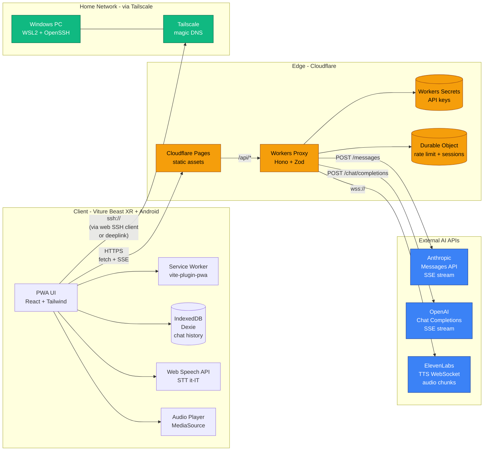
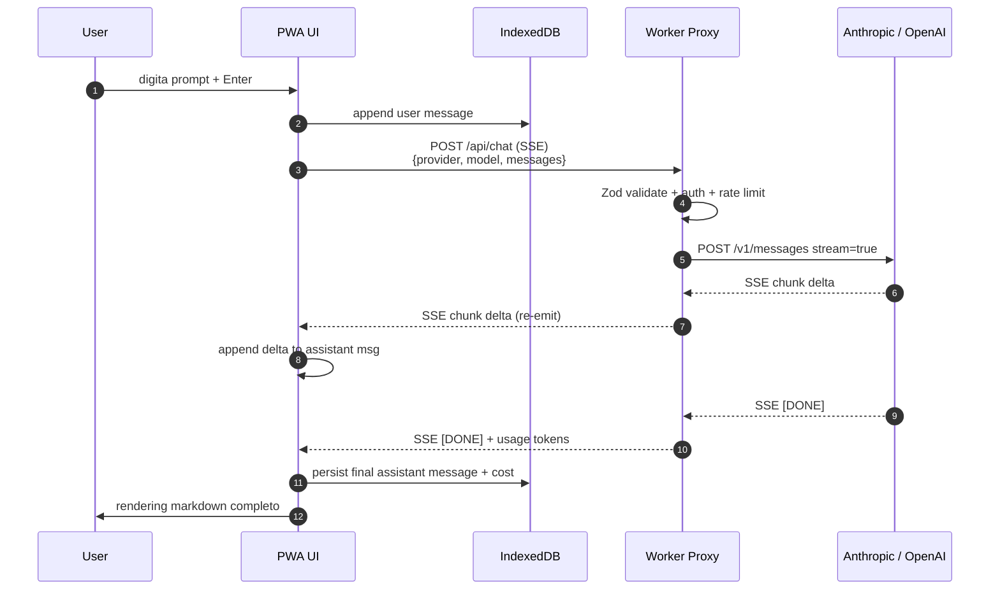
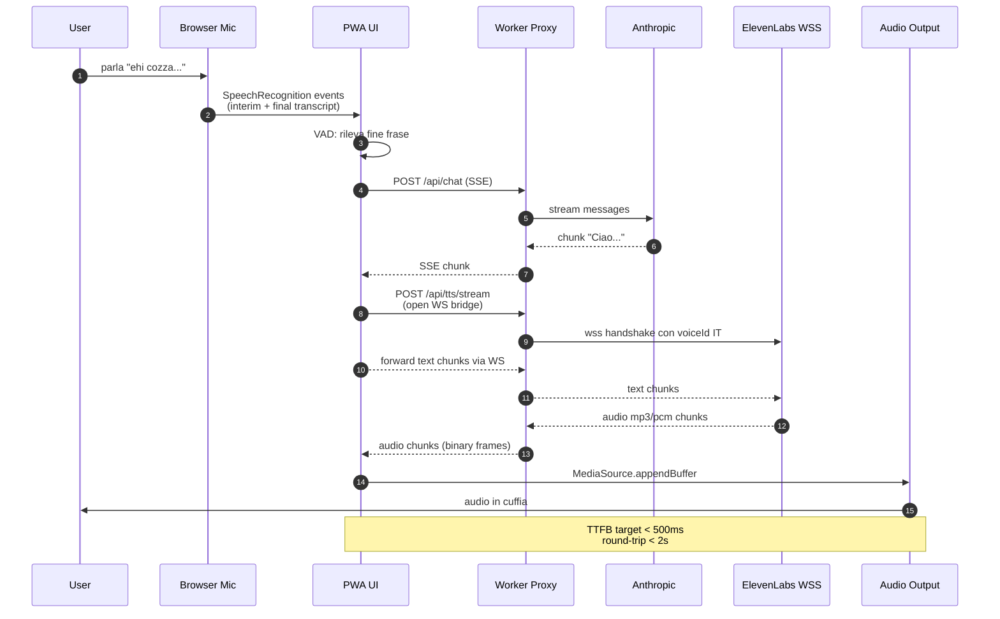
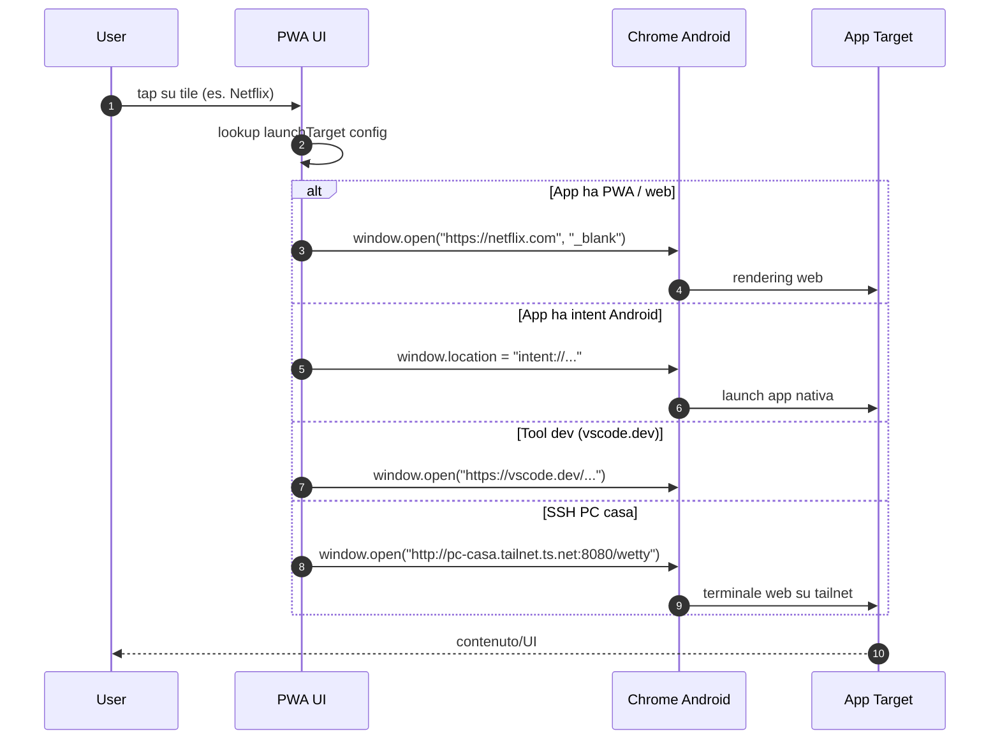

# cozza-ai - Solution Architecture

> Documento di architettura tecnica - Versione 1.0
> Autore: solution-architect
> Data: 2026-05-01
> Stato: APPROVED FOR IMPLEMENTATION

---

## 1. Executive Summary architetturale

cozza-ai e' una **Progressive Web App** mono-utente progettata per essere il "cockpit" personale di Cozza su smart glasses **Viture Beast XR** collegati via USB-C a un telefono Android. La piattaforma aggrega in un'unica UI i due principali LLM commerciali (Anthropic Claude e OpenAI GPT), fornisce un loop voice bidirezionale a bassa latenza tramite Web Speech API + ElevenLabs Streaming TTS, ed espone un launcher per app multimediali e tool di sviluppo (incluso accesso SSH al PC di casa via Tailscale).

**Visione architetturale**: thin client PWA + backend proxy stateless. Il client e' un bundle Vite/React/TypeScript servito staticamente; nessuna API key vive mai nel browser. Tutte le chiamate verso provider esterni (Anthropic, OpenAI, ElevenLabs) transitano da un proxy serverless (Cloudflare Workers) che applica auth, rate limiting, validation e audit logging.

**Principi guida** (in ordine di priorita'):
1. **Sicurezza by default** - zero-trust sul client, defense-in-depth sul backend, secrets isolati in vault.
2. **Latenza percepita < 2s end-to-end voice** - streaming ovunque (SSE per LLM, chunked audio per TTS), no round-trip inutili.
3. **Cost-efficiency** - target operativo < 30 EUR/mese inclusi i token API; modelli "small" come default, escalation a modelli grossi solo on-demand.

**Decisioni chiave (3-bullet recap)**:
- **Frontend**: Vite + React 18 + TypeScript + Zustand + vite-plugin-pwa. Single Page App con routing client-side, IndexedDB (Dexie) per chat history locale.
- **Backend**: Cloudflare Workers come API proxy (free tier copre il traffico atteso); secrets in Workers Secrets; Durable Objects opzionali per rate limiting persistente.
- **Voice pipeline**: Web Speech API per STT (zero cost, lingua it-IT), ElevenLabs Streaming WebSocket per TTS (voce italiana, TTFB ~300ms).

---

## 2. Tech Stack completo

| Componente | Scelta | Motivazione | Alternativa scartata | Perche' scartata |
|---|---|---|---|---|
| Build tool | **Vite 5** | HMR < 50ms, build ESM-first, plugin PWA maturo, zero config friction | Webpack / Turbopack | Webpack troppo lento in dev; Turbopack ancora instabile fuori da Next |
| UI framework | **React 18** | Ecosistema maturo, Concurrent rendering, Suspense per streaming | SvelteKit, Vue 3 | Familiarita' del team con React; ricchezza di librerie per streaming chat (Vercel AI SDK UI) |
| Language | **TypeScript 5.4** strict | Type safety end-to-end, interfacce condivise client/server | JavaScript + JSDoc | Imposto da CLAUDE.md, no compromessi |
| Styling | **TailwindCSS 3.4** + shadcn/ui | Utility-first, design system gia' fatto, dark mode nativo | CSS Modules, styled-components | Verbosita' e bundle size superiori |
| State management | **Zustand 4** | API minimale, no boilerplate, persist middleware, 1.2 KB gz | Redux Toolkit, Jotai, Context | Redux overkill per app mono-utente; Context provoca re-render eccessivi |
| Routing | **React Router 6** (data router) | Loader/action pattern, type-safe, ottimo per SPA non SSR | TanStack Router, file-based | TanStack ottimo ma piu' giovane; file-based richiede meta-framework |
| Storage client | **IndexedDB via Dexie 4** | Schema migration, query reattive con liveQuery, ~22 KB | localStorage, Backend SQLite | localStorage troppo limitato (5 MB); backend storage = costo + complessita' inutile per single-user |
| Voice STT | **Web Speech API** (browser native) | Zero costo, supporto it-IT, on-device su Chrome | Whisper API, Deepgram | Whisper costa 0.006 USD/min; Web Speech basta per qualita' richiesta |
| Voice TTS | **ElevenLabs Streaming WebSocket** | Voce italiana naturale, TTFB ~300ms, controllo prosodico | Azure TTS, Google TTS, OpenAI TTS | ElevenLabs ha qualita' superiore in italiano; costi controllabili con tier Starter |
| AI SDK Anthropic | **@anthropic-ai/sdk 0.27+** | SDK ufficiale, streaming SSE, types ufficiali | fetch raw | Boilerplate inutile, manca retry logic |
| AI SDK OpenAI | **openai 4.x** | SDK ufficiale, streaming, function calling | fetch raw | Idem |
| Backend proxy | **Cloudflare Workers** | Edge globale, free tier 100k req/giorno, secrets nativi, < 50ms cold start | Express su PC casa, Vercel Edge Functions | Express casa = SPOF (PC spento = down); Vercel ottimo ma vendor lock-in maggiore e free tier piu' stretto sui secret |
| Backend runtime helpers | **Hono 4** | Router minimale per Workers, middleware tipizzati, ~14 KB | itty-router, Express compat layer | Hono ha DX superiore, validator Zod nativo |
| Validation | **Zod 3** | Schema-first, type inference, ottimo con Hono | Yup, Joi, Valibot | Zod e' lo standard de facto in TS; Valibot interessante ma ecosistema piu' piccolo |
| Hosting client dev | **Vite dev server su WSL2** | HMR, accessibile via Tailscale magic DNS | Container Docker | Latenza HMR superiore in container su Windows |
| Hosting client prod | **Cloudflare Pages** | Stesso provider del Workers, rotte unificate, free tier generoso, edge cache | Vercel | Allineamento provider, costo zero, no vendor lock-in extra |
| Hosting backend prod | **Cloudflare Workers** | vedi sopra | Vercel Edge, Deno Deploy | vedi sopra |
| Logging | **pino** (server) + **console structured** (client) | JSON output, livelli, ridirigibile a Logtail/Axiom | winston, bunyan | Pino e' il piu' veloce e leggero |
| Monitoring | **Cloudflare Analytics + Workers Logs** + **Sentry** (free tier) | Metriche edge native, error tracking client | Datadog, New Relic | Costo elevato per progetto mono-utente |
| Testing unit | **Vitest** | Vite-native, API Jest-compatible, watch ultra-veloce | Jest | Jest config doloroso con Vite/ESM |
| Testing E2E | **Playwright** | Cross-browser, mobile emulation per Beast/Android | Cypress | Cypress no Safari/WebKit, no multi-tab decente |
| Linting | **ESLint 9** + **Prettier** + **eslint-plugin-security** | Standard | Biome | Biome promettente ma mancano regole security-focused |
| Package manager | **pnpm 9** | Veloce, content-addressable, monorepo-ready | npm, yarn | pnpm vince su tutti i benchmark |
| CI/CD | **GitHub Actions** | Integrato col repo, free per public/limit per private, marketplace ricco | CircleCI, Jenkins | Standard del mercato, zero config aggiuntiva |

---

## 3. System Architecture Diagram



Il client non parla mai direttamente con i provider AI. Tutto passa attraverso il Worker, che e' l'unico custode delle credenziali. Il PC di casa e' raggiungibile esclusivamente sulla tailnet privata.

---

## 4. Data Flow Diagrams

### Scenario A - Chat AI testuale



### Scenario B - Voice loop completo



### Scenario C - Launcher app esterna



---

## 5. Architecture Decision Records

### ADR-001 - Scelta framework frontend: Vite + React

**Status**: Accepted - 2026-05-01

**Context**: cozza-ai e' una SPA con streaming chat, voice I/O, layout responsive per uno schermo virtuale 174". Serve HMR rapido in sviluppo, bundle leggero in prod (target < 250 KB gz), e ricchezza di librerie per chat UI streaming.

**Decision**: **Vite 5 + React 18 + TypeScript strict**.

**Consequences**:
- (+) HMR sub-100ms, build prod con esbuild + Rollup, output ESM ottimizzato.
- (+) Ecosistema React: Vercel AI SDK UI (`useChat` hook con SSE), shadcn/ui, react-markdown.
- (+) Concurrent rendering / Suspense utili per streaming responses.
- (-) Bundle React + ReactDOM ~45 KB gz baseline (accettabile vs Svelte ~10 KB).
- (-) No SSR out-of-the-box; non e' un problema per app autenticata mono-utente.
- Alternative valutate: SvelteKit (bundle minore, ma minor familiarita' team e meno librerie chat); Next.js 14 (overkill SSR/RSC per SPA pura, vendor lock parziale a Vercel).

---

### ADR-002 - Backend proxy: Cloudflare Workers

**Status**: Accepted - 2026-05-01

**Context**: Serve un layer di proxy stateless che custodisce le API keys, applica rate limit, valida input, fa audit logging. Vincoli: costo < 5 EUR/mese, latenza added < 50 ms, deployment versionato. PC di casa non e' affidabile (spegnimenti, riavvii Windows Update).

**Decision**: **Cloudflare Workers** + Hono come router, Workers Secrets per le credenziali, Durable Objects opzionali per rate-limit persistente.

**Consequences**:
- (+) Free tier: 100k richieste/giorno (largamente sufficiente per uso personale).
- (+) Edge globale: latenza < 30 ms da Milano.
- (+) Cold start trascurabile (V8 isolates).
- (+) Streaming SSE supportato nativamente, WebSocket via `WebSocketPair`.
- (+) Secrets gestiti con `wrangler secret put`, mai nel codice.
- (-) Limite CPU 30s burst, 10ms CPU time per invocation (free) - non blocca SSE perche' tempo di attesa I/O non conta.
- (-) Niente filesystem, niente Node runtime - serve cura nelle dipendenze (no `fs`, `crypto.randomUUID()` ok, etc.).
- Alternative scartate:
  - Express su PC casa: SPOF, manutenzione OS, esposizione pubblica complessa.
  - Vercel Edge Functions: ottime, ma free tier piu' restrittivo e secrets meno flessibili in preview branches.
  - Deno Deploy: valido, ma minor maturita' WebSocket bridging.

---

### ADR-003 - Voice STT: Web Speech API

**Status**: Accepted - 2026-05-01

**Context**: Serve riconoscimento vocale in italiano, latenza percepita bassa, costo zero o minimo. L'utente lavora con cuffie a contatto del telefono Android, ambiente prevalentemente quieto.

**Decision**: **Web Speech API** (`SpeechRecognition` con `lang=it-IT`, `interimResults=true`). Whisper API resta come fallback opzionale dietro feature flag se la qualita' diventa insufficiente.

**Consequences**:
- (+) Zero costo per token audio.
- (+) On-device su Chrome Android (no audio inviato su rete da parte nostra).
- (+) Eventi interim utilizzabili per visual feedback (caption live).
- (-) Qualita' inferiore a Whisper su ambienti rumorosi.
- (-) Disponibilita' API non garantita su tutti i browser (ok su Chrome target).
- (-) Privacy nota: Chrome puo' inviare audio a Google per processing (documentato, accettato).
- Mitigation: astrazione `SttProvider` interface, swap a Whisper API in 1 ora se serve.

---

### ADR-004 - Storage conversation history: IndexedDB via Dexie

**Status**: Accepted - 2026-05-01

**Context**: Servono persistenza locale delle conversazioni, ricerca full-text leggera, sync futuro opzionale. Volume atteso: < 50 MB in 12 mesi.

**Decision**: **IndexedDB con wrapper Dexie 4**. Schema versionato, indici su `sessionId`, `createdAt`, `provider`. Nessun sync server-side nella v1.

**Consequences**:
- (+) Tutto on-device, privacy massima.
- (+) Nessun costo storage backend.
- (+) Dexie liveQuery per UI reattiva senza Redux store separato.
- (-) Nessun cross-device sync (accettabile: l'utente lavora prevalentemente da Beast+Android).
- (-) Backup manuale: implementare export/import JSON (feature v1.1).
- Alternative: Turso (SQLite distribuito) per sync futuro - tenuto come opzione v2.

---

### ADR-005 - PWA strategy

**Status**: Accepted - 2026-05-01

**Context**: cozza-ai deve installarsi come app sul telefono Android (icona homescreen, splash screen, full-screen sui Beast), funzionare offline per la UI base, gestire update senza rotture.

**Decision**: **vite-plugin-pwa** con strategia Workbox **`generateSW`** + `injectManifest` per logiche custom. Manifest `display: fullscreen`, `orientation: landscape`, `theme_color: #0a0a0a`. Service Worker con:
- **App shell**: precache di HTML/CSS/JS hashati.
- **Runtime cache**: `NetworkFirst` per `/api/*` (timeout 5s, fallback cache).
- **Update flow**: prompt utente "Nuova versione disponibile - Ricarica" via `registerSW({ onNeedRefresh })`.
- **Offline fallback**: route `/offline` con history locale leggibile, chat disabilitato.

**Consequences**:
- (+) Installabile su Android, full-screen sui Beast.
- (+) Avvio ~200ms da cold con app shell precached.
- (-) Service Worker debugging non banale - serve disciplina su `skipWaiting` e versioning.
- (-) iOS: PWA ridotta (non target primario, ok).

---

### ADR-006 - Auth & API key protection

**Status**: Accepted - 2026-05-01

**Context**: App mono-utente, ma esposta su Internet pubblico. Le API keys (Anthropic, OpenAI, ElevenLabs) hanno costo associato e devono essere protette anche dal proprio frontend in caso di compromissione XSS.

**Decision**: schema **multi-layer**:
1. **CORS allowlist**: il Worker accetta solo `Origin` in `https://cozza-ai.pages.dev` e `https://cozza.dev` (custom domain).
2. **Token applicativo**: il client invia header `X-Cozza-Token` con valore generato lato server alla prima sessione, persistito in `httpOnly` cookie + memoria. Token rotato ogni 7 giorni.
3. **Device fingerprint soft**: hash di `userAgent + screen + timezone` come secondo fattore (non crittograficamente sicuro, ma alza il bar).
4. **Rate limiting**: Durable Object per IP (60 req/min) e per token (300 req/h). Risposta 429 con `Retry-After`.
5. **Secrets**: `ANTHROPIC_API_KEY`, `OPENAI_API_KEY`, `ELEVENLABS_API_KEY` in Workers Secrets, mai loggati, mai esposti in errori.
6. **Zod validation**: ogni request body validato; modello e provider in allowlist (`claude-sonnet-4-6`, `claude-haiku-4-5`, `gpt-4o-mini`, `gpt-4o`).
7. **Audit log**: ogni chiamata logga `{ ts, route, provider, model, tokensIn, tokensOut, costEUR, status }` su Workers Logs (no prompt content).

**Consequences**:
- (+) Difesa in profondita': anche XSS sul client non da' accesso diretto alle keys.
- (+) Cost cap effettivo: rate limit + model allowlist = budget controllabile.
- (-) Complessita' implementativa moderata (~2 giornate dev).
- (-) Token rotation richiede UX di re-issue se utente cambia device.

---

### ADR-007 - Multi-display layout per Beast 3DoF

**Status**: Accepted - 2026-05-01

**Context**: Viture Beast XR offre uno schermo virtuale fino a 174" con FOV 58 gradi. Risoluzione effettiva 1920x1080 (downscale), aspect 16:9. Non c'e' multi-monitor nativo via DP Alt Mode. L'utente puo' usare la testa per "guardare" zone diverse dello schermo.

**Decision**: **single-pane responsive ad ancore**. UI a 3 zone fisse (sinistra: launcher tile + nav, centro: chat stream, destra: info panel + voice waveform), ognuna ottimizzata per essere vista con micro-rotazione testa. Layout Tailwind `grid-cols-[280px_1fr_320px]` su breakpoint `xl:`. Toggle a single-pane su Android stand-alone (`md:` e inferiori).

**Consequences**:
- (+) Sfrutta il FOV ampio dei Beast senza simulare desktop multi-window (che sarebbe disorientante a 3DoF).
- (+) Stessa codebase scala ad Android phone-only.
- (-) Non sfrutta full 174" - accettabile, leggibilita' > spettacolarita'.
- Alternativa scartata: layout 32:9 ultrawide. Scartato perche' molti contenuti (markdown lungo, code block) si leggono male su righe troppo larghe.

---

## 6. Sicurezza

Riassunto consolidato delle misure (estende ADR-006).

### API keys
- Storage: **Cloudflare Workers Secrets** (`wrangler secret put ANTHROPIC_API_KEY`).
- Rotazione: trimestrale, automatizzata via GitHub Action manuale.
- Mai nel bundle client, mai in repo, mai in log.

### CORS
```typescript
const ALLOWED_ORIGINS = [
  'https://cozza-ai.pages.dev',
  'https://cozza.dev',
  // dev only, gated da env:
  ...(env.ENV === 'dev' ? ['http://localhost:5173', 'http://100.x.x.x:5173'] : []),
];
```

### CSP header (servito da Cloudflare Pages via `_headers`)
```
Content-Security-Policy:
  default-src 'self';
  script-src 'self' 'wasm-unsafe-eval';
  style-src 'self' 'unsafe-inline';
  connect-src 'self' https://api.cozza.dev wss://api.cozza.dev;
  media-src 'self' blob:;
  img-src 'self' data: blob:;
  font-src 'self';
  frame-ancestors 'none';
  base-uri 'self';
  form-action 'self';
```
Nessun `unsafe-inline` su script, nessun `unsafe-eval`. `wasm-unsafe-eval` consentito per eventuali codec audio.

### Rate limiting
Durable Object `RateLimiter` con sliding window:
- Per IP: 60 req/min (anti-abuso generale).
- Per token: 300 req/h (cap costo personale).
- Per modello "expensive" (gpt-4o, claude-sonnet-4-6): 50 req/h dedicato.

### Input validation con Zod
```typescript
const ChatRequestSchema = z.object({
  provider: z.enum(['anthropic', 'openai']),
  model: z.enum(['claude-haiku-4-5', 'claude-sonnet-4-6', 'gpt-4o-mini', 'gpt-4o']),
  messages: z.array(z.object({
    role: z.enum(['user', 'assistant', 'system']),
    content: z.string().min(1).max(50_000),
  })).min(1).max(100),
  stream: z.literal(true),
  maxTokens: z.number().int().min(1).max(8192).optional(),
});
```

### Logging strutturato
- Mai loggare: contenuto messaggi, token API, cookie, header `Authorization`.
- Loggare: timestamp ISO, route, provider, model, tokens in/out, costo stimato, status code, hash(SHA-256) del `tokenId` utente, requestId.
- Esempio:
```json
{"ts":"2026-05-01T10:23:11Z","level":"info","route":"/api/chat","provider":"anthropic","model":"claude-haiku-4-5","tokensIn":312,"tokensOut":540,"costEUR":0.0021,"status":200,"userHash":"a3f...","requestId":"01J..."}
```

### HTTPS enforcement
- HSTS header: `Strict-Transport-Security: max-age=63072000; includeSubDomains; preload`.
- Cloudflare flag "Always Use HTTPS" attivo.
- HTTP/3 abilitato.

### Defense in depth
Anche se il frontend e' compromesso, il Worker:
1. Verifica `Origin` (CORS).
2. Verifica `X-Cozza-Token` valido e non revocato.
3. Applica rate limit per token.
4. Valida payload con Zod (no model arbitrari).
5. Limita `maxTokens` lato server (override hard cap a 8192).
6. Loggia ogni anomalia per alerting.

---

## 7. Hosting strategy

### Sviluppo locale
- **Vite dev server**: `pnpm dev` su WSL2, ascolto su `0.0.0.0:5173`.
- **Worker dev**: `wrangler dev --ip 0.0.0.0 --port 8787` su stesso WSL2.
- **Tailscale**: il PC ha hostname `cozza-pc.tailnet-XYZ.ts.net`. Da Beast/Android (anch'essi sulla tailnet) si accede a:
  - Frontend: `http://cozza-pc.tailnet-XYZ.ts.net:5173`
  - Worker:   `http://cozza-pc.tailnet-XYZ.ts.net:8787`
- **HTTPS dev**: opzionale via `mkcert` + Tailscale Funnel se serve testare service worker (richiede HTTPS).

### Staging
- **Cloudflare Pages preview deployments**: ogni PR genera URL `https://<branch>.cozza-ai.pages.dev`.
- Worker corrispondente: deploy automatico su environment `preview` (`wrangler deploy --env preview`).
- Secrets staging separati (chiavi API con quota ridotta).

### Produzione
- **Frontend**: Cloudflare Pages, custom domain `https://cozza.dev` (CNAME a Pages).
- **Backend**: Cloudflare Worker su `https://api.cozza.dev` (custom route).
- **DNS**: Cloudflare DNS, DNSSEC attivo.
- Costo: 0 EUR/mese fino a free tier limits.

### CI/CD - GitHub Actions

```yaml
# .github/workflows/ci.yml
name: CI
on: [push, pull_request]
jobs:
  test:
    runs-on: ubuntu-latest
    steps:
      - uses: actions/checkout@v4
      - uses: pnpm/action-setup@v4
      - uses: actions/setup-node@v4
        with: { node-version: 20, cache: pnpm }
      - run: pnpm install --frozen-lockfile
      - run: pnpm lint
      - run: pnpm typecheck
      - run: pnpm test
      - run: pnpm build
  e2e:
    needs: test
    runs-on: ubuntu-latest
    steps:
      - uses: actions/checkout@v4
      - run: pnpm playwright install --with-deps
      - run: pnpm test:e2e
  deploy-preview:
    if: github.event_name == 'pull_request'
    needs: e2e
    runs-on: ubuntu-latest
    steps:
      - uses: cloudflare/wrangler-action@v3
        with:
          apiToken: ${{ secrets.CF_API_TOKEN }}
          command: deploy --env preview
  deploy-prod:
    if: github.ref == 'refs/heads/main'
    needs: e2e
    runs-on: ubuntu-latest
    environment: production
    steps:
      - uses: cloudflare/wrangler-action@v3
        with:
          apiToken: ${{ secrets.CF_API_TOKEN }}
          command: deploy --env production
```

Branch protection su `main`: PR obbligatoria, review opzionale (single-dev), CI green required, no force push.

---

## 8. Integrazioni esterne

| Servizio | Endpoint | Auth | Rate limit upstream | Costo stimato | Fallback |
|---|---|---|---|---|---|
| Anthropic Messages | `POST https://api.anthropic.com/v1/messages` | header `x-api-key` + `anthropic-version: 2023-06-01` | 4000 req/min, 400k tok/min (tier 2) | claude-haiku-4-5: ~0.0008 EUR/1k in - ~0.004 EUR/1k out; sonnet-4-6: ~0.003/0.015 | switch a OpenAI con banner "Anthropic down" |
| OpenAI Chat | `POST https://api.openai.com/v1/chat/completions` | header `Authorization: Bearer ...` | tier 2 | gpt-4o-mini: ~0.00014/0.00056 EUR/1k; gpt-4o: ~0.0023/0.0093 | switch a Anthropic |
| ElevenLabs TTS | `wss://api.elevenlabs.io/v1/text-to-speech/{voice_id}/stream-input` | header `xi-api-key` | piano Starter: 30k char/mese | ~5 EUR/mese (Starter); ~22 EUR/mese (Creator) | fallback a Web Speech `speechSynthesis` (qualita' inferiore ma gratuito) |
| Tailscale | tailnet privata, magic DNS | OAuth Tailscale (out-of-band) | n/a | 0 EUR (tier personal, fino a 100 device) | nessuno (se Tailscale down, no SSH; modalita' degraded accettata) |
| Cloudflare Pages/Workers | edge runtime | wrangler API token | 100k req/giorno free | 0 EUR atteso | nessuno (sarebbe outage piattaforma) |
| (Future) Google Calendar | `googleapis.com/calendar/v3` | OAuth 2.0 + refresh token | 1M req/giorno | gratis | feature opzionale |
| (Future) Gmail | `googleapis.com/gmail/v1` | OAuth 2.0 | 1bn quota units/giorno | gratis | feature opzionale |

**Cost cap totale stimato (steady state)**: ~10 EUR/mese (LLM uso moderato) + 5 EUR/mese ElevenLabs Starter = **~15 EUR/mese** con margine sotto i 30 EUR target.

---

## 9. Struttura di progetto proposta

```
cozza-ai/
|-- .github/
|   `-- workflows/
|       |-- ci.yml                     # lint + test + build
|       `-- deploy.yml                 # preview + prod
|-- docs/
|   |-- 01-business-analysis.md
|   |-- 02-solution-architecture.md    # questo file
|   |-- 03-api-spec.md                 # OpenAPI 3.1
|   |-- decisions/                     # ADR aggiuntivi futuri
|   `-- runbook.md
|-- public/
|   |-- icons/                         # PWA icons 192/512
|   |-- manifest.webmanifest
|   `-- robots.txt                     # Disallow: /
|-- src/                               # CLIENT - React + TS
|   |-- main.tsx                       # entry, registerSW
|   |-- App.tsx
|   |-- routes/
|   |   |-- index.tsx                  # / chat
|   |   |-- launcher.tsx               # /launcher
|   |   |-- settings.tsx
|   |   `-- offline.tsx
|   |-- components/
|   |   |-- chat/
|   |   |   |-- chat-stream.tsx
|   |   |   |-- message-bubble.tsx
|   |   |   `-- model-picker.tsx
|   |   |-- voice/
|   |   |   |-- voice-button.tsx
|   |   |   |-- waveform.tsx
|   |   |   `-- caption-overlay.tsx
|   |   |-- launcher/
|   |   |   `-- app-tile.tsx
|   |   `-- ui/                        # shadcn primitives
|   |-- features/
|   |   |-- chat/
|   |   |   |-- chat-store.ts          # Zustand slice
|   |   |   |-- chat-api.ts            # SSE client
|   |   |   `-- chat-types.ts
|   |   |-- voice/
|   |   |   |-- stt-service.ts         # Web Speech wrapper
|   |   |   |-- tts-service.ts         # ElevenLabs WS client
|   |   |   `-- vad.ts                 # voice activity detection
|   |   `-- launcher/
|   |       `-- launcher-config.ts
|   |-- lib/
|   |   |-- db.ts                      # Dexie schema
|   |   |-- logger.ts                  # client structured logger
|   |   |-- env.ts                     # import.meta.env validato Zod
|   |   `-- errors.ts                  # custom error classes
|   |-- hooks/
|   |   |-- use-chat-stream.ts
|   |   `-- use-voice-loop.ts
|   |-- styles/
|   |   `-- globals.css                # Tailwind directives
|   `-- vite-env.d.ts
|-- server/                            # BACKEND - Cloudflare Worker
|   |-- src/
|   |   |-- index.ts                   # Hono app entry
|   |   |-- routes/
|   |   |   |-- chat.ts                # POST /api/chat (SSE)
|   |   |   |-- tts.ts                 # WS /api/tts/stream
|   |   |   `-- health.ts
|   |   |-- middleware/
|   |   |   |-- cors.ts
|   |   |   |-- auth.ts
|   |   |   |-- rate-limit.ts
|   |   |   `-- audit-log.ts
|   |   |-- providers/
|   |   |   |-- anthropic.ts
|   |   |   |-- openai.ts
|   |   |   `-- elevenlabs.ts
|   |   |-- durable-objects/
|   |   |   `-- rate-limiter.ts
|   |   |-- schemas/
|   |   |   `-- chat-request.ts        # Zod schemas
|   |   |-- lib/
|   |   |   |-- logger.ts
|   |   |   `-- errors.ts
|   |   `-- types.ts
|   |-- wrangler.toml
|   `-- tsconfig.json
|-- tests/
|   |-- unit/                          # vitest
|   |-- integration/                   # vitest + miniflare
|   `-- e2e/                           # playwright
|-- .env.example
|-- .gitignore
|-- .eslintrc.cjs
|-- .prettierrc
|-- index.html
|-- package.json
|-- pnpm-workspace.yaml                # se monorepo client/server
|-- tsconfig.json
|-- tsconfig.client.json
|-- tsconfig.server.json
|-- tailwind.config.ts
|-- postcss.config.cjs
|-- vite.config.ts
|-- playwright.config.ts
`-- README.md
```

Workspace pnpm con due package: `@cozza-ai/client` e `@cozza-ai/server`, con un package shared `@cozza-ai/shared` per Zod schemas e types comuni.

---

## 10. Performance budget

| Metrica | Target | Note |
|---|---|---|
| Bundle JS initial (gz) | **< 220 KB** | route-based code splitting, lazy load voice module e launcher |
| Bundle CSS (gz) | **< 20 KB** | Tailwind con purge aggressivo |
| First Contentful Paint (4G, Beast) | **< 1.2 s** | app shell precached da SW, < 200 ms da PWA installata |
| Largest Contentful Paint | **< 2.0 s** | first paint chat skeleton |
| Time to Interactive | **< 2.5 s** | hydration React 18 con Concurrent |
| Voice STT first interim | **< 300 ms** | Web Speech native |
| Voice TTS TTFB (audio chunk #1) | **< 500 ms** | ElevenLabs streaming WSS |
| Voice end-to-end round-trip | **< 2.0 s** | dal "fine frase" a "primo audio in cuffia", modello haiku |
| LLM streaming TTFT (Claude haiku) | **< 600 ms** | latenza Worker -> Anthropic + edge |
| Memory client steady state | **< 120 MB** | misurato su Chrome Android dopo 30 min uso |
| Memory peak (5 chat aperte + voice) | **< 200 MB** | Beast non ha pressione memoria, ma Android si' |
| Service Worker cache size | **< 5 MB** | app shell + manifest |
| IndexedDB growth | **< 5 MB / 1000 messaggi** | text plain, no media inlined |

Misurazione automatica: Lighthouse CI in pipeline (`pnpm lhci autorun`) con budget enforcement; fallisce build se regressione > 10% su LCP o bundle size.

---

## 11. Observability

Approccio "**pragmatic minimal**": tre livelli, zero dipendenze paid in v1.

### Logging strutturato
- **Server (Worker)**: `pino` (compatibile Workers via `pino/browser`); output JSON su `console.log`, raccolto da Workers Logs (free tier 7 giorni di retention).
- **Client**: wrapper minimale `logger` (`info | warn | error | debug`), output `console` in dev, `navigator.sendBeacon('/api/logs', ...)` in prod per errori critici.
- **Schema condiviso**:
```typescript
type LogEvent = {
  ts: string;            // ISO 8601
  level: 'debug'|'info'|'warn'|'error';
  msg: string;
  requestId?: string;    // ULID
  userHash?: string;     // SHA-256 token
  route?: string;
  provider?: 'anthropic'|'openai'|'elevenlabs';
  model?: string;
  tokensIn?: number;
  tokensOut?: number;
  costEUR?: number;
  durationMs?: number;
  errorCode?: string;
};
```

### Metriche
- **Cloudflare Analytics** (free): RPS, error rate, p50/p95 latency per route.
- **Custom counters** via Workers Analytics Engine (1 dataset gratuito): `cozza_ai_costs` con dimensions `provider, model`, metric `costEUR`. Query SQL su Analytics Engine per dashboard mensile.
- **Sentry free tier** per error tracking client + Worker uncaught (5k errors/mese gratis).

### Dashboard
v1: query SQL su Analytics Engine + script `pnpm report:monthly` che genera markdown con:
- Spesa totale per provider.
- Tokens totali in/out.
- Top 10 sessioni per costo.
- Error rate per route.
- Voice round-trip p50/p95.

Output salvato in `docs/reports/YYYY-MM.md`. Niente Grafana/Datadog: overhead non giustificato per single-user.

### Alerting
- Cloudflare email notification se error rate > 5% per 10 min.
- Sentry email su nuovi error type.
- Cost guard: Worker calcola `costEUR` cumulativo del giorno; se > 2 EUR/giorno, restituisce 503 con messaggio "daily budget reached" finche' non resettato manualmente. Hard cap di sicurezza.

---

## Appendice - Riepilogo decisioni

1. Stack: Vite + React 18 + TypeScript strict + Tailwind + Zustand + Dexie.
2. Backend: Cloudflare Workers + Hono + Zod + Workers Secrets.
3. Voice: Web Speech (STT) + ElevenLabs Streaming WS (TTS).
4. Hosting: Cloudflare Pages (frontend) + Workers (backend), entrambi free tier.
5. PWA: vite-plugin-pwa, fullscreen landscape, app shell precached.
6. Sicurezza: CORS allowlist + token rotativo + rate limit DO + Zod + CSP strict.
7. Costo target: ~15 EUR/mese steady, hard cap 30 EUR/mese.
8. Observability: pino + Cloudflare Analytics + Sentry free tier.

Documento pronto per Phase 1 (Foundation): consegna a `data-engineer` per schema Dexie/IndexedDB e a `devops-engineer` per scaffold repo + CI/CD.
