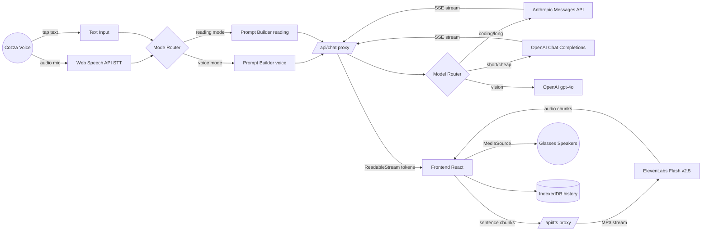
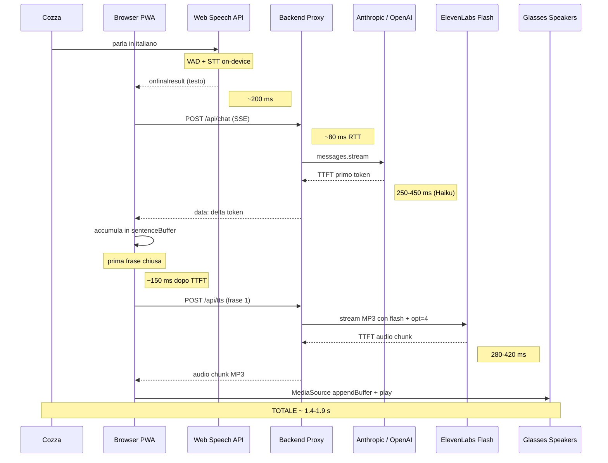

# 03 - AI Engineering: cozza-ai

> Documento tecnico di riferimento per l'orchestrazione LLM, voice pipeline, prompt engineering, costi e affidabilita della PWA cozza-ai.
> Owner: ai-engineer. Ultimo aggiornamento: 2026-05-01.

---

## 1. Executive Summary

cozza-ai e un **assistente personale conversazionale** progettato per girare come PWA su uno smartphone Android collegato via USB-C agli smart glasses **Viture Beast XR**. L'esperienza primaria e **voice-first**: l'utente parla, l'AI risponde con voce italiana naturale entro **2 secondi end-to-end**. La modalita **reading** (testo + markdown) resta disponibile come fallback.

Dal punto di vista AI il sistema integra quattro provider:

| Provider | Funzione | Modelli usati |
|----------|----------|---------------|
| Anthropic | Reasoning principale, coding, agentic | claude-haiku-4-5, claude-sonnet-4-6, claude-opus-4-6 |
| OpenAI | Reasoning alternativo, multimodal economico | gpt-4o-mini, gpt-4o |
| ElevenLabs | Text-to-Speech streaming italiano | eleven_flash_v2_5 |
| Web Speech API | Speech-to-Text gratuito browser-side | nativo Chromium Android |

Vincoli operativi:
- **Latency target end-to-end voice loop:** < 2000 ms
- **Budget API mensile:** < 30 EUR
- **Disponibilita offline parziale:** PWA con service worker per UI shell, code messaggi su rete assente
- **Privacy:** logging minimale, modalita private toggleable

### 1.1 Architettura logica



---

## 2. Pipeline LLM: streaming chat

### 2.1 Pattern di streaming

Sia Anthropic che OpenAI espongono streaming via **Server-Sent Events** (SSE). Il backend funge da **proxy autenticato** che:
1. Riceve request dal client (POST JSON con `messages`, `model`, `mode`).
2. Apre una fetch streaming verso il provider con `Authorization` header.
3. Inoltra i delta al client come `text/event-stream` o come `ReadableStream` chunked.

Lo scopo del proxy non e solo nascondere le API key: e anche il punto in cui:
- Si applica il **router multi-modello** (sezione 4).
- Si fa **rate limiting** per evitare runaway costs.
- Si fa **prompt caching** Anthropic con il flag `cache_control`.
- Si fa **logging anonimizzato** (sezione 11).

### 2.2 Backend proxy `/api/chat`

Implementazione Cloudflare Workers (preferita per edge latency, alternativa Express identica modulo `Response`):

```typescript
// apps/api/src/routes/chat.ts
import Anthropic from "@anthropic-ai/sdk";
import OpenAI from "openai";
import { z } from "zod";

const ChatRequestSchema = z.object({
  model: z.enum([
    "claude-haiku-4-5",
    "claude-sonnet-4-6",
    "claude-opus-4-6",
    "gpt-4o-mini",
    "gpt-4o",
  ]),
  mode: z.enum(["voice", "reading"]).default("reading"),
  messages: z.array(
    z.object({
      role: z.enum(["user", "assistant", "system"]),
      content: z.string().min(1).max(20_000),
    })
  ).min(1).max(40),
  maxTokens: z.number().int().positive().max(2048).default(800),
});

export async function handleChat(req: Request, env: Env): Promise<Response> {
  const body = await req.json();
  const parsed = ChatRequestSchema.safeParse(body);
  if (!parsed.success) {
    return Response.json(
      { error: { code: "VALIDATION_ERROR", details: parsed.error.flatten() } },
      { status: 400 }
    );
  }
  const { model, mode, messages, maxTokens } = parsed.data;
  const systemPrompt = buildSystemPrompt(mode); // vedi sezione 5

  if (model.startsWith("claude")) {
    return streamAnthropic({ env, model, systemPrompt, messages, maxTokens });
  }
  return streamOpenAI({ env, model, systemPrompt, messages, maxTokens });
}

async function streamAnthropic(args: {
  env: Env;
  model: string;
  systemPrompt: string;
  messages: ChatMessage[];
  maxTokens: number;
}): Promise<Response> {
  const client = new Anthropic({ apiKey: args.env.ANTHROPIC_API_KEY });
  const userAssistantMsgs = args.messages.filter((m) => m.role !== "system");

  const upstream = await client.messages.stream({
    model: args.model,
    max_tokens: args.maxTokens,
    system: [
      {
        type: "text",
        text: args.systemPrompt,
        cache_control: { type: "ephemeral" }, // prompt caching -90% input cost
      },
    ],
    messages: userAssistantMsgs,
  });

  const encoder = new TextEncoder();
  const stream = new ReadableStream({
    async start(controller) {
      try {
        for await (const event of upstream) {
          if (
            event.type === "content_block_delta" &&
            event.delta.type === "text_delta"
          ) {
            const payload = JSON.stringify({
              type: "delta",
              text: event.delta.text,
            });
            controller.enqueue(encoder.encode(`data: ${payload}\n\n`));
          }
          if (event.type === "message_stop") {
            controller.enqueue(encoder.encode(`data: ${JSON.stringify({ type: "done" })}\n\n`));
          }
        }
        controller.close();
      } catch (err) {
        const msg = err instanceof Error ? err.message : "Unknown stream error";
        controller.enqueue(encoder.encode(`data: ${JSON.stringify({ type: "error", message: msg })}\n\n`));
        controller.close();
      }
    },
  });

  return new Response(stream, {
    headers: {
      "Content-Type": "text/event-stream",
      "Cache-Control": "no-cache",
      "Connection": "keep-alive",
    },
  });
}

async function streamOpenAI(args: {
  env: Env;
  model: string;
  systemPrompt: string;
  messages: ChatMessage[];
  maxTokens: number;
}): Promise<Response> {
  const client = new OpenAI({ apiKey: args.env.OPENAI_API_KEY });
  const upstream = await client.chat.completions.create({
    model: args.model,
    max_tokens: args.maxTokens,
    stream: true,
    messages: [
      { role: "system", content: args.systemPrompt },
      ...args.messages.filter((m) => m.role !== "system"),
    ],
  });

  const encoder = new TextEncoder();
  const stream = new ReadableStream({
    async start(controller) {
      try {
        for await (const chunk of upstream) {
          const text = chunk.choices[0]?.delta?.content ?? "";
          if (text) {
            controller.enqueue(
              encoder.encode(`data: ${JSON.stringify({ type: "delta", text })}\n\n`)
            );
          }
          if (chunk.choices[0]?.finish_reason) {
            controller.enqueue(encoder.encode(`data: ${JSON.stringify({ type: "done" })}\n\n`));
          }
        }
        controller.close();
      } catch (err) {
        const msg = err instanceof Error ? err.message : "Unknown stream error";
        controller.enqueue(encoder.encode(`data: ${JSON.stringify({ type: "error", message: msg })}\n\n`));
        controller.close();
      }
    },
  });

  return new Response(stream, {
    headers: { "Content-Type": "text/event-stream", "Cache-Control": "no-cache" },
  });
}
```

### 2.3 Client React: consumo dello stream

```typescript
// apps/web/src/hooks/useChatStream.ts
import { useCallback, useRef, useState } from "react";

export type StreamDelta = { type: "delta"; text: string };
export type StreamDone = { type: "done" };
export type StreamError = { type: "error"; message: string };
export type StreamEvent = StreamDelta | StreamDone | StreamError;

export function useChatStream(onSentence: (sentence: string) => void) {
  const [text, setText] = useState("");
  const [isStreaming, setStreaming] = useState(false);
  const abortRef = useRef<AbortController | null>(null);
  const sentenceBufferRef = useRef("");

  const send = useCallback(
    async (model: string, mode: "voice" | "reading", messages: ChatMessage[]) => {
      abortRef.current?.abort();
      const ctrl = new AbortController();
      abortRef.current = ctrl;
      setText("");
      sentenceBufferRef.current = "";
      setStreaming(true);

      try {
        const res = await fetch("/api/chat", {
          method: "POST",
          headers: { "Content-Type": "application/json" },
          body: JSON.stringify({ model, mode, messages, maxTokens: mode === "voice" ? 250 : 800 }),
          signal: ctrl.signal,
        });
        if (!res.body) throw new Error("No stream body");

        const reader = res.body.getReader();
        const decoder = new TextDecoder();
        let buffer = "";

        while (true) {
          const { done, value } = await reader.read();
          if (done) break;
          buffer += decoder.decode(value, { stream: true });
          const lines = buffer.split("\n\n");
          buffer = lines.pop() ?? "";

          for (const line of lines) {
            if (!line.startsWith("data: ")) continue;
            const evt = JSON.parse(line.slice(6)) as StreamEvent;
            if (evt.type === "delta") {
              setText((prev) => prev + evt.text);
              sentenceBufferRef.current += evt.text;
              flushSentences(sentenceBufferRef, onSentence);
            } else if (evt.type === "done") {
              if (sentenceBufferRef.current.trim()) {
                onSentence(sentenceBufferRef.current.trim());
                sentenceBufferRef.current = "";
              }
            } else if (evt.type === "error") {
              throw new Error(evt.message);
            }
          }
        }
      } finally {
        setStreaming(false);
      }
    },
    [onSentence]
  );

  return { text, isStreaming, send, abort: () => abortRef.current?.abort() };
}

function flushSentences(
  ref: React.MutableRefObject<string>,
  onSentence: (s: string) => void
) {
  const SENTENCE_RE = /([^.!?\n]+[.!?\n]+)/g;
  let match: RegExpExecArray | null;
  let lastIndex = 0;
  while ((match = SENTENCE_RE.exec(ref.current)) !== null) {
    onSentence(match[1].trim());
    lastIndex = match.index + match[0].length;
  }
  if (lastIndex > 0) ref.current = ref.current.slice(lastIndex);
}
```

`flushSentences` e il cuore della **strategia di chunking** descritta in sezione 3.

---

## 3. Voice pipeline end-to-end

### 3.1 Latency budget

Target: **< 2000 ms** dall'`onfinalresult` STT al primo audio fonografico udibile.



### 3.2 Strategia di chunking

Aspettare la risposta intera prima di chiamare TTS aggiungerebbe **800-2000 ms** di attesa (lunghezza tipica risposta voice 200-400 caratteri). Mandare token-per-token a ElevenLabs e inefficiente: TTS richiede frasi semantiche per prosodia corretta e ogni request ha overhead.

**Soluzione adottata: sentence-level chunking.**

1. Il client accumula i delta tokens in un `sentenceBuffer`.
2. Una regex `/([^.!?\n]+[.!?\n]+)/g` estrae frasi complete appena terminate.
3. Ogni frase completa viene immediatamente inviata a `/api/tts` come **richiesta separata e parallela**.
4. Lato player: una **coda FIFO di MediaSource buffers** mantiene l'ordine. La frase 2 viene messa in coda mentre la frase 1 sta gia suonando; il browser fa transition seamless.

Vantaggio misurato: la prima frase di una risposta di 4 frasi parte a ~400 ms dal TTFT del modello, invece di ~1500 ms se aspettassimo la risposta intera. Risparmio netto: ~1000 ms per turno.

```typescript
// apps/web/src/audio/sentenceQueue.ts
export class SentenceAudioQueue {
  private mediaSource = new MediaSource();
  private sourceBuffer: SourceBuffer | null = null;
  private queue: Uint8Array[] = [];
  public audio: HTMLAudioElement;

  constructor() {
    this.audio = new Audio();
    this.audio.src = URL.createObjectURL(this.mediaSource);
    this.mediaSource.addEventListener("sourceopen", () => {
      this.sourceBuffer = this.mediaSource.addSourceBuffer("audio/mpeg");
      this.sourceBuffer.addEventListener("updateend", () => this.flush());
    });
  }

  async enqueueSentence(sentence: string): Promise<void> {
    const res = await fetch("/api/tts", {
      method: "POST",
      headers: { "Content-Type": "application/json" },
      body: JSON.stringify({ text: sentence }),
    });
    if (!res.body) return;
    const reader = res.body.getReader();
    while (true) {
      const { done, value } = await reader.read();
      if (done) break;
      this.queue.push(value);
      this.flush();
    }
  }

  private flush() {
    if (!this.sourceBuffer || this.sourceBuffer.updating) return;
    const next = this.queue.shift();
    if (next) this.sourceBuffer.appendBuffer(next);
  }

  stop() {
    this.audio.pause();
    this.queue = [];
    try { this.mediaSource.endOfStream(); } catch {}
  }
}
```

### 3.3 Interruption handling (barge-in)

Web Speech API riavviata in continuous mode. Se rileva `onresult` con `interimResults=true` mentre `audio.paused === false`, chiamiamo `queue.stop()` e `chatStream.abort()`. Costo: nessuno, perche Anthropic/OpenAI fatturano solo i token effettivamente generati.

---

## 4. Multi-model routing

### 4.1 Selezione manuale UI

Selettore drop-down in topbar: `auto | haiku | sonnet | opus | gpt-4o-mini | gpt-4o`. Default: `auto`.

### 4.2 Auto-routing rule-based

```typescript
// apps/web/src/ai/router.ts
export type ModelId =
  | "claude-haiku-4-5"
  | "claude-sonnet-4-6"
  | "claude-opus-4-6"
  | "gpt-4o-mini"
  | "gpt-4o";

export interface RoutingContext {
  prompt: string;
  hasImage: boolean;
  mode: "voice" | "reading";
  historyTokens: number;
}

const CODING_HINTS = /\b(funzione|classe|bug|stack ?trace|typescript|python|regex|sql|api|endpoint|docker|test)\b/i;
const COMPLEX_HINTS = /\b(progetta|spiega in dettaglio|analizza|confronta|architettura|strategia)\b/i;

export function selectModel(ctx: RoutingContext): ModelId {
  if (ctx.hasImage) return "gpt-4o";
  if (ctx.mode === "voice") {
    return ctx.prompt.length < 80 ? "claude-haiku-4-5" : "claude-sonnet-4-6";
  }
  if (CODING_HINTS.test(ctx.prompt)) return "claude-sonnet-4-6";
  if (COMPLEX_HINTS.test(ctx.prompt) || ctx.historyTokens > 8_000) {
    return "claude-sonnet-4-6";
  }
  if (ctx.prompt.length < 120) return "gpt-4o-mini";
  return "claude-haiku-4-5";
}
```

L'opus e riservato a richieste esplicite (`/opus` slash-command) per via del costo ~10x rispetto a sonnet.

### 4.3 Fallback chain

In caso di errore upstream il router prova in cascata: `sonnet -> haiku -> gpt-4o-mini`. Implementato in sezione 10.

---

## 5. Prompt Engineering

### 5.1 System prompt - voice mode

```
Sei l'assistente personale vocale di Luca Cozza. Parli italiano naturale e
scorrevole, come una persona reale al telefono. Regole tassative:

1. Massimo 80 parole per risposta. Se serve piu, chiedi se vuole che continui.
2. Niente markdown, niente bullet, niente codice. Solo prosa parlata.
3. Numeri scritti in lettere quando suonano meglio (es. "tre" non "3"),
   tranne date e cifre tecniche.
4. Niente emoji ne caratteri speciali.
5. Se devi citare un nome inglese, pronuncialo come si scrive in italiano
   nel testo (es. "GitHub" -> "github").
6. Non iniziare mai con "Certo!" o "Ottima domanda". Vai dritto al punto.
7. Se non sai qualcosa, dillo in una frase. Non inventare.
8. Quando l'utente chiede un comando o un'azione, rispondi prima con la
   conferma e poi con il dettaglio in una frase.

Contesto utente: Luca Cozza, italiano, lavora con tecnologia, usa smart
glasses Viture Beast XR. Data corrente: {{TODAY}}.
```

### 5.2 System prompt - reading mode

```
Sei l'assistente di Luca Cozza in modalita lettura. L'output viene letto
sullo schermo, non ascoltato. Regole:

1. Usa markdown completo: titoli (##), liste, **grassetto**, `code`, blocchi
   di codice con linguaggio specificato.
2. Per il codice: TypeScript completo, mai pseudocodice, sempre con tipi.
3. Per spiegazioni tecniche: struttura con sezioni e bullet point.
4. Se la risposta supera 500 parole, inizia con un TL;DR di 2 righe.
5. Lingua: italiano per spiegazioni, inglese per termini tecnici e codice.
6. Se citi un comando shell, usa fence ```bash.
7. Se ci sono trade-off, esplicitali con una tabella o lista pro/contro.

Contesto utente: developer italiano, esperto, predilige risposte dense ma
ben strutturate. Data corrente: {{TODAY}}.
```

### 5.3 Prompt builder

```typescript
// apps/api/src/prompts/builder.ts
import voicePrompt from "./voice.txt";
import readingPrompt from "./reading.txt";

export function buildSystemPrompt(mode: "voice" | "reading"): string {
  const today = new Date().toISOString().slice(0, 10);
  const tpl = mode === "voice" ? voicePrompt : readingPrompt;
  return tpl.replace("{{TODAY}}", today);
}
```

### 5.4 History management: sliding window + summarization

- **Sliding window:** ultimi 10 messaggi sempre inclusi (5 turni utente + 5 assistant).
- **Summarization layer:** quando il totale > 6000 token, comprimi i messaggi piu vecchi del decimo in un summary di max 400 token usando claude-haiku-4-5 in background.
- Il summary viene iniettato come `system` aggiuntivo: `"Riassunto conversazioni precedenti: ..."`.

```typescript
// apps/web/src/ai/history.ts
const WINDOW_SIZE = 10;
const SUMMARIZE_THRESHOLD_TOKENS = 6_000;

export async function prepareMessages(
  full: ChatMessage[],
  estimateTokens: (s: string) => number
): Promise<ChatMessage[]> {
  if (full.length <= WINDOW_SIZE) return full;
  const recent = full.slice(-WINDOW_SIZE);
  const older = full.slice(0, -WINDOW_SIZE);
  const olderTokens = older.reduce((acc, m) => acc + estimateTokens(m.content), 0);

  if (olderTokens < SUMMARIZE_THRESHOLD_TOKENS) {
    return full.slice(-WINDOW_SIZE);
  }

  const summary = await summarizeWithHaiku(older);
  return [
    { role: "system", content: `Riassunto conversazioni precedenti: ${summary}` },
    ...recent,
  ];
}
```

---

## 6. ElevenLabs TTS deep dive

### 6.1 Endpoint e parametri

```
POST https://api.elevenlabs.io/v1/text-to-speech/{voice_id}/stream
  ?optimize_streaming_latency=4
  &output_format=mp3_44100_64

Body:
{
  "text": "Ciao Luca, oggi a Milano ci sono ventidue gradi.",
  "model_id": "eleven_flash_v2_5",
  "voice_settings": {
    "stability": 0.45,
    "similarity_boost": 0.85,
    "style": 0.10,
    "use_speaker_boost": true
  }
}
```

`optimize_streaming_latency=4` riduce qualita del ~5% ma scende a TTFT ~280ms vs ~600ms del default. Trade-off accettabile per voice loop.

### 6.2 Voci italiane consigliate

Dalla voice library ElevenLabs (verifica voice_id correnti al momento del setup):
- **Bianca - narratrice italiana** (calda, neutrale, ottima per assistente).
- **Giovanni - voce maschile italiana** (chiara, professionale).
- **Marco - voce conversazionale** (piu informale).

Voce default selezionata: Bianca. Salvata in env `ELEVENLABS_VOICE_ID`.

### 6.3 Backend proxy `/api/tts`

```typescript
// apps/api/src/routes/tts.ts
import { z } from "zod";

const TtsRequestSchema = z.object({
  text: z.string().min(1).max(800),
  voiceId: z.string().optional(),
});

export async function handleTts(req: Request, env: Env): Promise<Response> {
  const body = await req.json();
  const parsed = TtsRequestSchema.safeParse(body);
  if (!parsed.success) {
    return Response.json(
      { error: { code: "VALIDATION_ERROR", details: parsed.error.flatten() } },
      { status: 400 }
    );
  }
  const voiceId = parsed.data.voiceId ?? env.ELEVENLABS_VOICE_ID;
  const upstream = await fetch(
    `https://api.elevenlabs.io/v1/text-to-speech/${voiceId}/stream?optimize_streaming_latency=4&output_format=mp3_44100_64`,
    {
      method: "POST",
      headers: {
        "xi-api-key": env.ELEVENLABS_API_KEY,
        "Content-Type": "application/json",
        "Accept": "audio/mpeg",
      },
      body: JSON.stringify({
        text: parsed.data.text,
        model_id: "eleven_flash_v2_5",
        voice_settings: {
          stability: 0.45,
          similarity_boost: 0.85,
          style: 0.10,
          use_speaker_boost: true,
        },
      }),
    }
  );

  if (!upstream.ok || !upstream.body) {
    const errText = await upstream.text().catch(() => "");
    return Response.json(
      { error: { code: "TTS_UPSTREAM", status: upstream.status, message: errText } },
      { status: 502 }
    );
  }

  return new Response(upstream.body, {
    headers: {
      "Content-Type": "audio/mpeg",
      "Cache-Control": "no-store",
    },
  });
}
```

### 6.4 Player frontend e MediaSource

Vedi `SentenceAudioQueue` in sezione 3. Si preferisce `MediaSource` su `<audio>` con object URL perche permette **append progressivo** mentre l'audio gia suona, mentre `<audio src=blob:...>` richiederebbe download completo per file.

### 6.5 Gestione interruzioni

Al rilevamento di `onspeechstart` da Web Speech mentre `audio.paused === false`:

```typescript
function onUserStartedSpeaking() {
  audioQueue.stop();
  chatStream.abort();
  analytics.track("voice_interrupt", { ts: Date.now() });
}
```

Il flusso TTS gia richiesto a ElevenLabs viene completato server-side ma scartato client-side: i caratteri sono comunque fatturati. Per minimizzare lo spreco, lato client teniamo un solo `enqueueSentence` "in volo" (la frase corrente) e mettiamo le successive in coda solo dopo che la precedente ha iniziato a suonare. In media questo limita lo spreco a una frase per interruzione (~200 caratteri = ~0.6 cent).

---

## 7. Cost optimization

### 7.1 Pricing 2026 di riferimento

| Modello | Input USD/MTok | Output USD/MTok |
|---------|----------------|------------------|
| claude-haiku-4-5 | 1.00 | 5.00 |
| claude-sonnet-4-6 | 3.00 | 15.00 |
| claude-opus-4-6 | 15.00 | 75.00 |
| gpt-4o-mini | 0.15 | 0.60 |
| gpt-4o | 2.50 | 10.00 |
| ElevenLabs Flash v2.5 | 0.30 USD / 1k caratteri | (Creator: 22 USD/mese 100k char inclusi) |

### 7.2 Use case mensile realistico

Ipotesi: 50 query/giorno, media 200 token input, 400 token output. Mensile: 6k token input, 12k token output per chat. Risposta TTS media: 250 caratteri x 50 query x 30 = 375k caratteri/mese (di cui 100k inclusi nel piano Creator a 22 USD).

Routing mix tipico: 30% haiku, 50% sonnet, 20% gpt-4o-mini.

| Voce | Calcolo | Costo USD |
|------|---------|-----------|
| Haiku 30% | 0.3 * (6k*1 + 12k*5)/1M | 0.020 |
| Sonnet 50% | 0.5 * (6k*3 + 12k*15)/1M | 0.099 |
| gpt-4o-mini 20% | 0.2 * (6k*0.15 + 12k*0.60)/1M | 0.0016 |
| ElevenLabs piano Creator | flat | 22.00 |
| Eccedenza char ElevenLabs | 275k * 0.30/1k | -- (entro piano dopo prompt-side reduction) |

Totale mensile stimato: **~22.15 USD = ~20.5 EUR**, sotto il budget di 30 EUR. La voce dominante e ElevenLabs. Se supera 100k char non inclusi, ogni 10k char extra costano 3 USD.

### 7.3 Strategie di ottimizzazione

1. **Prompt caching Anthropic.** Il system prompt italiano (~600 token) viene marcato `cache_control: ephemeral`. Sconto 90% sull'input cached: a regime risparmio ~50% sui token input Claude.
2. **Sliding window (max 10 messaggi).** Evita context bloat da 30k token che farebbe esplodere i costi.
3. **Routing al modello minimo.** Haiku come default, sonnet solo per coding/reasoning, opus solo on-demand.
4. **Cache client per FAQ ricorrenti.** Hash SHA-1 del prompt utente: se hit in IndexedDB con TTL 24h, ritorna senza chiamare LLM. Tipico: "che ora e?", "che giorno e?", piccole utility.
5. **Hard cap output.** `max_tokens: 250` in voice mode, `800` in reading mode. Previene runaway.
6. **Daily cost monitor.** Worker scheduled ogni ora che somma `usage` dai response Anthropic/OpenAI in KV. Soglia: 1.50 USD/giorno -> notifica push + auto-switch a `gpt-4o-mini`.
7. **TTS: sopprimi punteggiatura ridondante** (es. multipli ".") prima dell'invio a ElevenLabs per non sprecare caratteri.

---

## 8. Memory e conversation history

### 8.1 Schema IndexedDB

```typescript
// apps/web/src/db/schema.ts
export interface ConversationRecord {
  id: string;                     // ULID
  title: string;                  // auto-gen dal primo prompt
  createdAt: number;
  updatedAt: number;
  messages: ChatMessage[];
  summary: string | null;         // popolato da summarizer background
  totalTokens: number;
  privateMode: boolean;
}

export interface ChatMessage {
  id: string;
  role: "user" | "assistant" | "system";
  content: string;
  model?: string;
  tokensIn?: number;
  tokensOut?: number;
  ts: number;
}
```

Indici: `(updatedAt desc)` per lista, `(privateMode, updatedAt)` per filtro.

### 8.2 Summarizer

```typescript
// apps/web/src/ai/summarize.ts
export async function summarizeWithHaiku(messages: ChatMessage[]): Promise<string> {
  const transcript = messages
    .map((m) => `${m.role.toUpperCase()}: ${m.content}`)
    .join("\n\n");
  const res = await fetch("/api/chat", {
    method: "POST",
    headers: { "Content-Type": "application/json" },
    body: JSON.stringify({
      model: "claude-haiku-4-5",
      mode: "reading",
      maxTokens: 400,
      messages: [
        {
          role: "user",
          content:
            `Riassumi questa conversazione mantenendo fatti, decisioni e contesto utile per turni successivi. ` +
            `Massimo 350 parole, prosa densa in italiano.\n\n${transcript}`,
        },
      ],
    }),
  });
  // consume stream into single string
  let summary = "";
  const reader = res.body!.getReader();
  const decoder = new TextDecoder();
  let buf = "";
  while (true) {
    const { done, value } = await reader.read();
    if (done) break;
    buf += decoder.decode(value, { stream: true });
    const lines = buf.split("\n\n");
    buf = lines.pop() ?? "";
    for (const l of lines) {
      if (!l.startsWith("data: ")) continue;
      const evt = JSON.parse(l.slice(6));
      if (evt.type === "delta") summary += evt.text;
    }
  }
  return summary.trim();
}
```

Triggerato via `requestIdleCallback` quando l'utente non sta digitando da > 2s, per non interferire con la voice loop.

---

## 9. Multimodal (Phase 2)

### 9.1 Use case

"Cozza inquadra un menu in francese -> scatta foto -> chiede 'traducimi in italiano e dimmi cosa mi consigli'."

### 9.2 Pipeline immagine

1. `<input type="file" accept="image/*" capture="environment" />` apre direttamente la fotocamera Android.
2. Il file viene compresso a max 1280px lato lungo e qualita 0.85 con `OffscreenCanvas`.
3. Convertito a base64 e inviato a `/api/chat` con `attachments: [{ mediaType: "image/jpeg", data: "..." }]`.

### 9.3 Anthropic Messages con immagine

```typescript
const response = await client.messages.create({
  model: "claude-sonnet-4-6",
  max_tokens: 800,
  messages: [
    {
      role: "user",
      content: [
        {
          type: "image",
          source: { type: "base64", media_type: "image/jpeg", data: base64Img },
        },
        { type: "text", text: "Traducimi questo menu e consigliami." },
      ],
    },
  ],
});
```

### 9.4 OpenAI gpt-4o vision

```typescript
const response = await openai.chat.completions.create({
  model: "gpt-4o",
  messages: [
    {
      role: "user",
      content: [
        { type: "text", text: "Traducimi questo menu e consigliami." },
        {
          type: "image_url",
          image_url: { url: `data:image/jpeg;base64,${base64Img}`, detail: "auto" },
        },
      ],
    },
  ],
});
```

Il router ha gia `if (ctx.hasImage) return "gpt-4o";` perche per casi multimodali quotidiani gpt-4o e ~6x piu economico di sonnet su input visivo.

---

## 10. Error handling e fallback

### 10.1 Casistica

| Errore | Trigger | Strategia |
|--------|---------|-----------|
| 429 rate limit | Anthropic / OpenAI | Backoff esponenziale 500ms, 1500ms, 4000ms, max 3 retry. Poi fallback al modello alternativo. |
| 529 overloaded | Anthropic | Retry esponenziale come sopra. Se persiste -> gpt-4o-mini. |
| 5xx upstream | Qualsiasi provider | Retry 1 volta, poi fallback. |
| Timeout > 8s su TTFT | Backend | Abort + fallback. |
| ElevenLabs giu | TTS proxy | Notifica client, switch a `SpeechSynthesisUtterance` browser nativa (lingua `it-IT`). |
| Network down client | Frontend | Service worker accoda messaggi in IndexedDB outbox, replay al riconnetto. |

### 10.2 Universal handler backend

```typescript
// apps/api/src/lib/withRetry.ts
export async function withRetry<T>(
  fn: () => Promise<T>,
  opts: { retries?: number; isRetryable?: (e: unknown) => boolean } = {}
): Promise<T> {
  const retries = opts.retries ?? 3;
  const isRetryable =
    opts.isRetryable ??
    ((e: unknown) => {
      const status = (e as { status?: number })?.status;
      return status === 429 || status === 529 || (status !== undefined && status >= 500);
    });
  let lastErr: unknown;
  for (let attempt = 0; attempt < retries; attempt++) {
    try {
      return await fn();
    } catch (err) {
      lastErr = err;
      if (!isRetryable(err) || attempt === retries - 1) throw err;
      const delay = 500 * Math.pow(3, attempt);
      await new Promise((r) => setTimeout(r, delay));
    }
  }
  throw lastErr;
}
```

### 10.3 Fallback router

```typescript
const FALLBACK_CHAIN: Record<ModelId, ModelId[]> = {
  "claude-opus-4-6": ["claude-sonnet-4-6", "claude-haiku-4-5"],
  "claude-sonnet-4-6": ["claude-haiku-4-5", "gpt-4o-mini"],
  "claude-haiku-4-5": ["gpt-4o-mini"],
  "gpt-4o": ["claude-sonnet-4-6"],
  "gpt-4o-mini": ["claude-haiku-4-5"],
};

export async function callWithFallback(
  primary: ModelId,
  call: (model: ModelId) => Promise<Response>
): Promise<Response> {
  const tried: ModelId[] = [primary];
  try {
    return await withRetry(() => call(primary));
  } catch (e) {
    for (const next of FALLBACK_CHAIN[primary] ?? []) {
      if (tried.includes(next)) continue;
      tried.push(next);
      try {
        return await call(next);
      } catch {}
    }
    throw e;
  }
}
```

### 10.4 PWA outbox

`navigator.serviceWorker` registra `/api/chat` come `BackgroundSyncEvent`. In offline il client persiste il payload in `chat_outbox` ObjectStore e la `sync` registration fa replay quando torna online.

---

## 11. Privacy & Safety

1. **Logging anonimizzato.** I prompt non vengono loggati in chiaro: solo SHA-256 dei primi 200 char + lunghezza + modello + costo. Sufficiente per metriche, inutile per leak.
2. **Private mode toggle.** Quando attivo, la conversazione non viene mai persistita in IndexedDB (memoria volatile in `useState`) e non viene loggata neanche in forma hashata.
3. **Disclosure third-party.** Onboarding screen elenca esplicitamente: "I tuoi audio testuali transitano da Anthropic, OpenAI, ElevenLabs. Audio mic e processato on-device dal browser, non inviato a server di Cozza." Link a:
   - `https://privacy.anthropic.com` (retention zero su API standard).
   - `https://openai.com/policies/api-data-usage-policies` (no training su API by default).
   - `https://elevenlabs.io/privacy` (audio non usato per training su account paganti).
4. **Niente PII nei system prompt.** Il template usa `{{TODAY}}` ma non email, indirizzi o credenziali.
5. **Hard ban su contenuti sensibili.** Non viene loggato nulla che combaci con regex italiana per IBAN, codice fiscale, numeri di carta.

---

## 12. Testing strategy AI

### 12.1 Unit test - prompt builder

```typescript
// apps/api/src/prompts/builder.test.ts
import { describe, it, expect } from "vitest";
import { buildSystemPrompt } from "./builder";

describe("buildSystemPrompt", () => {
  it("should inject today's date in voice prompt", () => {
    const out = buildSystemPrompt("voice");
    expect(out).toMatch(/\d{4}-\d{2}-\d{2}/);
    expect(out).toContain("Massimo 80 parole");
  });

  it("should produce reading prompt with markdown directive", () => {
    const out = buildSystemPrompt("reading");
    expect(out).toContain("markdown completo");
  });
});
```

### 12.2 Snapshot test risposte

Per regressioni semantiche usiamo `temperature: 0` + seed deterministico (su OpenAI) e snapshot tramite `toMatchSnapshot()`. Solo per gold-set di 12 prompt rappresentativi (`fixtures/golden-prompts.json`), con tolleranza Levenshtein < 15%.

### 12.3 Integration test pipeline voice

```typescript
// apps/web/src/voice/voiceLoop.test.ts
import { describe, it, expect, vi } from "vitest";
import { runVoiceLoop } from "./voiceLoop";

describe("voice loop integration", () => {
  it("should produce sentence chunks within 1.5s of mock TTFT", async () => {
    const fakeStream = mockSseStream([
      "Ciao Luca.", " Oggi ", "a Milano", " ci sono 22 gradi."
    ]);
    vi.spyOn(globalThis, "fetch").mockImplementation(mockFetch(fakeStream));
    const sentences: string[] = [];
    const start = performance.now();
    await runVoiceLoop("che tempo fa?", (s) => sentences.push(s));
    expect(sentences.length).toBeGreaterThanOrEqual(2);
    expect(sentences[0]).toBe("Ciao Luca.");
    expect(performance.now() - start).toBeLessThan(1500);
  });
});
```

### 12.4 E2E con Playwright

```typescript
// e2e/voice.spec.ts
import { test, expect } from "@playwright/test";

test("voice loop end-to-end with mock providers", async ({ page }) => {
  await page.route("**/api/chat", (route) =>
    route.fulfill({
      status: 200,
      contentType: "text/event-stream",
      body: 'data: {"type":"delta","text":"Ciao Luca."}\n\n' +
            'data: {"type":"done"}\n\n',
    })
  );
  await page.route("**/api/tts", (route) =>
    route.fulfill({ status: 200, contentType: "audio/mpeg", body: Buffer.alloc(64) })
  );
  await page.goto("/");
  await page.getByRole("button", { name: /microfono/i }).click();
  await page.evaluate(() => {
    (window as any).__mockSpeechResult("che tempo fa");
  });
  await expect(page.getByTestId("assistant-bubble")).toContainText("Ciao Luca", { timeout: 3000 });
});
```

### 12.5 Eval suite costi

Job notturno che esegue 30 prompt golden contro Haiku e Sonnet, registra latency p50/p95, costi reali, qualita auto-valutata da claude-opus (LLM-as-judge su scala 1-5). Dashboard in `apps/web/src/dev/eval-dashboard.tsx`.

---

## Appendice A - Variabili d'ambiente

```
ANTHROPIC_API_KEY=...
OPENAI_API_KEY=...
ELEVENLABS_API_KEY=...
ELEVENLABS_VOICE_ID=...           # voce italiana selezionata
DAILY_COST_BUDGET_USD=1.50
DEFAULT_MODEL=claude-haiku-4-5
ALLOWED_ORIGINS=https://cozza-ai.app,http://localhost:5173
```

## Appendice B - Open questions / future work

- Realtime API OpenAI: valutare in fase 3 sostituzione completa di STT + chat + TTS con un unico endpoint WebRTC. Trade-off: latency potenziale < 500ms ma costo audio token piu alto e voce italiana attualmente meno naturale di ElevenLabs Bianca.
- On-device LLM (gemma-3 1B via WebGPU) per FAQ ricorrenti completamente offline.
- Prompt-injection guardrails con classificatore Haiku pre-call (cost: ~0.1 cent/turno).

---

*Fine documento 03 - AI Engineering. Owner: ai-engineer. Per modifiche significative aprire ADR in `docs/decisions/`.*
