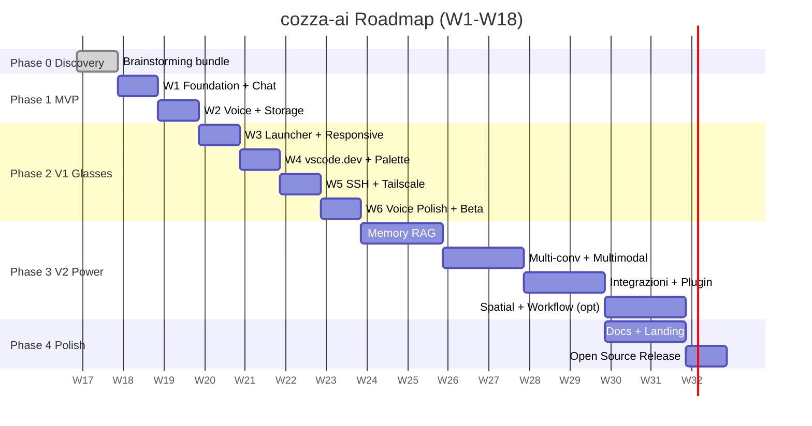

# cozza-ai — Roadmap & Risk Matrix

> Documento prodotto dal `project-orchestrator` (Opus) come parte del brainstorming bundle di Phase 0.
> Owner: Cozza | Data: 2026-05-01 | Versione: 1.0
> Lingua: italiano | Stack: Vite + React + TS + Tailwind + PWA, Node/Express o Cloudflare Workers, ElevenLabs, Tailscale.

---

## 1. Vision & North Star

**cozza-ai e' completo quando, fra 6 mesi, Cozza puo' camminare per casa con i suoi Viture Beast indossati, dire "Ehi cozza-ai" e ricevere risposta vocale da Claude o GPT in italiano in meno di 2 secondi, lanciare Netflix sul soffitto, connettersi in SSH al PC di casa via Tailscale e aprire vscode.dev senza mai toccare un mouse.**

Non un altro wrapper ChatGPT: un **cockpit AI personale, voice-first, glasses-native**, costruito per essere usato 30 volte al giorno mentre Cozza fa altro (cucina, viaggia, lavora).

### I tre pilastri di prodotto

1. **AI Cockpit** — un'unica interfaccia per Claude (haiku-4-5, sonnet-4-6) e OpenAI (gpt-4o, gpt-4o-mini), con switching modello in 1 tap/comando vocale. L'AI e' il sistema operativo, non un'app.
2. **Voice Native** — la tastiera e' un fallback. Voice-in (Web Speech / Whisper), voice-out (ElevenLabs streaming italiano), wake word, barge-in, push-to-talk. Conversazione, non typing.
3. **Glasses Optimized** — UI progettata per il viewport ultrawide 32:9 dei Beast (3DoF, 1080p per occhio), font grandi, contrasti elevati, navigazione gaze + voice + ring-controller. Mobile/desktop come fallback dignitoso.

### Principi di prioritizzazione

- **Shipping early > completeness.** Meglio MVP scarno in 2 settimane che V1 perfetto in 4 mesi.
- **Voice over text.** Ogni feature nasce con un voice flow; il text e' bonus.
- **Glasses-first ma fallback mobile/desktop.** Cozza usera' i Beast 60% del tempo, lo smartphone 30%, desktop 10%. Tutti devono funzionare.
- **Personal-first.** cozza-ai e' costruito per Cozza, non per gli altri. Open source viene dopo.
- **Boring stack.** Vite, React, Express, Tailwind, IndexedDB. Niente esperimenti.

---

## 2. Roadmap d'insieme

| Fase | Durata | Goal | Status |
|------|--------|------|--------|
| Phase 0 — Discovery | done | Brainstorming bundle, business analysis, architecture, AI plan, UX, roadmap | done |
| Phase 1 — MVP | 2 settimane (W1-W2, ~20h) | Chat AI multi-modello (Claude + OpenAI) + voice loop completo + PWA installabile | pending |
| Phase 2 — V1 Glasses-Ready | 4 settimane (W3-W6, ~40h) | UI Beast 32:9 + launcher app + vscode.dev + SSH al PC casa + voice UX polish | pending |
| Phase 3 — V2 Power User | 8 settimane (W7-W14, ~80h) | Wake-word custom, memory RAG, integrazioni (calendar/mail), multimodal, plugin system | pending |
| Phase 4 — Polish & Open Source | continuo (W15+) | Documentazione bilingue, release pubblica, community, demo video, eventi | pending |

Totale: **~14 settimane di lavoro effettivo**, distribuite su **4-5 mesi reali** considerando il regime part-time di Cozza (5-10h/settimana, con buchi per ferie/vita).

---

## 3. Phase 0 — Discovery (status: done)

Phase 0 ha prodotto il **brainstorming bundle** completo, salvato in `cozza-ai/docs/`:

| File | Owner | Contenuto |
|------|-------|-----------|
| `01-business-analysis.md` | business-analyst | Personas, user stories, requisiti funzionali, KPI, criteri di accettazione |
| `02-solution-architecture.md` | solution-architect | Stack completo, ADR, diagrammi C4, data flow, deployment topology |
| `03-ai-engineering.md` | ai-engineer | Strategia LLM, routing modelli, prompt templates, voice pipeline, costi token |
| `04-ux-design.md` | ux-ui-designer + art-director | Wireframe, design system, palette dark, typography Beast-ready, voice UX |
| `05-roadmap.md` | project-orchestrator | Questo documento |

In aggiunta sono stati prodotti un **executive brief** (1 pagina, riassunto per Cozza) e un **kickoff prompt** (da incollare in Claude Code per partire con W1).

Output: bundle pronto, **forza Cozza, attacchiamo W1!**

---

## 4. Phase 1 — MVP (2 settimane, ~20h di lavoro)

### Obiettivo MVP

Una **PWA installabile sul telefono Android di Cozza** che permette di:
- chattare con Claude (haiku-4-5, sonnet-4-6) e OpenAI (gpt-4o, gpt-4o-mini) in streaming;
- usare voice loop completo (parla -> trascrizione -> AI risponde -> sintesi vocale ElevenLabs in italiano);
- avere uno storage locale dell'history;
- girare su HTTPS con backend proxy che custodisce le API keys.

UI dark-mode gia' usabile sui Beast quando arriveranno, ma **non ottimizzata 32:9 al 100%** (quello e' Phase 2).

### Definition of Done MVP

- [ ] PWA installabile su Android Chrome (manifest + service worker + add-to-home-screen funzionante)
- [ ] Chat con Claude `haiku-4-5` e `sonnet-4-6` in streaming SSE
- [ ] Chat con OpenAI `gpt-4o-mini` e `gpt-4o` in streaming SSE
- [ ] Selettore modello visibile in UI (dropdown + scorciatoia tastiera)
- [ ] Voice input via Web Speech API (`lang=it-IT`) con feedback visivo (waveform / pulse)
- [ ] TTS via ElevenLabs streaming con voce italiana selezionata e cache audio
- [ ] Backend proxy con env vars per `ANTHROPIC_API_KEY`, `OPENAI_API_KEY`, `ELEVENLABS_API_KEY`
- [ ] Rate limiting basic (`express-rate-limit`, 30 req/min per IP)
- [ ] Storage history in IndexedDB via Dexie (conversazioni, messaggi, modello, timestamp)
- [ ] Dark mode forzato (no system toggle)
- [ ] HTTPS attivo in dev (mkcert o ngrok) e prod (Vercel auto)
- [ ] Smoke test manuale: 3 query end-to-end voice loop (in italiano) registrate in CHANGELOG
- [ ] Costo API mensile osservato sotto **30 EUR**
- [ ] README.md base con istruzioni `pnpm install && pnpm dev`

### Sprint breakdown MVP

#### Settimana 1 — Foundation + Chat AI testuale

| Giorni | Task | Agenti |
|--------|------|--------|
| Lun-Mar | Scaffold Vite+React+TS+Tailwind, configurazione PWA (`vite-plugin-pwa`), deploy iniziale Vercel preview, struttura cartelle conforme a Section 5.1 di CLAUDE.md | senior-frontend-dev, devops-engineer |
| Mer-Gio | Backend proxy Express con endpoints `/api/chat/anthropic` e `/api/chat/openai` in streaming SSE, env vars con dotenv, rate limiting, validazione input con Zod | senior-backend-dev, security-auditor |
| Ven-Sab | UI chat: input area, message list virtualizzata, streaming display token-by-token, selettore modello, gestione errori user-friendly | senior-frontend-dev, ux-ui-designer |
| Domenica | Code review settimana 1, fix dei findings P0, smoke test E2E base con Playwright (1 happy path) | code-reviewer |

**Milestone W1**: chattare con Claude e OpenAI da telefono via testo, deployato su `cozza-ai.vercel.app` con HTTPS.

#### Settimana 2 — Voice loop + storage + polish

| Giorni | Task | Agenti |
|--------|------|--------|
| Lun-Mar | Integrazione Web Speech API per STT (italiano), voice button con stati (idle/listening/processing), gestione permessi microfono, fallback su browser non supportati | senior-frontend-dev, ai-engineer |
| Mer-Gio | Backend `/api/tts` proxy ElevenLabs streaming con voice ID italiano scelto, audio player frontend con MediaSource API, chunking a livello frase per ridurre TTFA | ai-engineer, senior-backend-dev |
| Ven-Sab | Storage IndexedDB con Dexie (schema: conversations, messages), history UI (lista conversazioni laterale), nuova conversazione, cancellazione | senior-frontend-dev, data-engineer |
| Domenica | Code review finale, security audit (focus: API keys leak, CSP, CORS), deploy MVP, registrazione demo video privato, aggiornamento CHANGELOG | code-reviewer, security-auditor |

**Milestone W2**: MVP shipping. Cozza usa cozza-ai come daily driver per 1 settimana prima di iniziare W3.

---

## 5. Phase 2 — V1 Glasses-Ready (4 settimane, ~40h)

### Obiettivo V1

Esperienza completa quando arriva il **Viture Beast**: UI ottimizzata 32:9, app launcher per i servizi piu' usati da Cozza, vscode.dev embedded, SSH client web verso il PC di casa, voice UX di livello consumer. Performance budget rispettato (TTI < 2s, TTFA voice < 1.5s).

### Sprint breakdown V1

#### W3 — App Launcher + Responsive 32:9 + Accessibility

**Goal**: trasformare cozza-ai in un launcher visivo per i servizi che Cozza usa quotidianamente.

| Task | Owner agent |
|------|-------------|
| Layout 32:9 con Tailwind breakpoints custom (`ultrawide: 3840px`, `beast: 32/9`) | senior-frontend-dev, ux-ui-designer |
| Tile launcher per Netflix, NOW, DAZN, Spotify, YouTube (deep link / web URL) | senior-frontend-dev |
| Accessibility AAA: contrasto 7:1 minimo, font 24px+ in modalita' Beast, focus ring 4px | ux-ui-designer, art-director |
| Voice command "Apri Netflix" -> launcher | ai-engineer |
| Sezione settings: scegli quali tile mostrare | senior-frontend-dev |

**Milestone W3**: cozza-ai e' anche un launcher sostitutivo della home screen Android.

#### W4 — vscode.dev Integration + Command Palette

**Goal**: portare l'editor dentro cozza-ai, accessibile via voce e tastiera.

| Task | Owner agent |
|------|-------------|
| Iframe vscode.dev embedding con sandbox attributes appropriati | senior-frontend-dev |
| Comunicazione tramite `window.postMessage` se esposta (verificare API VS Code Web), altrimenti documenta limitazioni | senior-frontend-dev, ai-engineer |
| Command Palette globale (`Ctrl+K` / "Apri palette") per navigare tra chat / launcher / vscode / SSH | senior-frontend-dev, ux-ui-designer |
| Shortcut tastiera consistenti, documentati in `/help` | ux-ui-designer |
| Fallback se CSP blocca l'iframe: pulsante "Apri vscode.dev in nuova scheda" | senior-frontend-dev |

**Milestone W4**: Cozza puo' editare codice dentro cozza-ai senza uscire dall'app.

#### W5 — Web SSH Client al PC di casa via Tailscale

**Goal**: terminale dentro la PWA che si connette al PC casa di Cozza via Tailscale.

| Task | Owner agent |
|------|-------------|
| Frontend xterm.js con tema dark, font Cascadia Code, dimensione adattiva | senior-frontend-dev |
| Backend WebSocket gateway (Node) che apre connessione SSH via libreria `ssh2` verso IP Tailscale (100.x.x.x) | senior-backend-dev, devops-engineer |
| Autenticazione: SSH key-based (chiave privata custodita lato server, mai esposta), 2FA via TOTP per accesso WS | security-auditor |
| Setup OpenSSH server su Windows 11 documentato in `docs/runbook.md` | devops-engineer |
| Voice command "Connetti casa" -> apre terminale con sessione pronta | ai-engineer |
| Test resilienza su 4G/5G con riconnect automatico | senior-backend-dev |

**Milestone W5**: Cozza puo' fare `ssh pc-casa` da qualsiasi rete e ricevere terminale dentro i Beast.

#### W6 — Voice UX Polish + Beta Testing

**Goal**: voice UX di livello consumer, pronta per uso quotidiano.

| Task | Owner agent |
|------|-------------|
| Wake word custom "Ehi cozza" via Picovoice Porcupine (free tier, custom model) | ai-engineer |
| Push-to-talk (long-press del ring-controller / tasto volume su) come alternativa | ai-engineer, senior-frontend-dev |
| Barge-in: se Cozza parla mentre TTS sta riproducendo, l'audio si ferma e parte STT | ai-engineer |
| Animazioni waveform reactive sull'input audio (Canvas + Web Audio Analyser) | senior-frontend-dev, art-director |
| Indicatori stato chiari (idle / listening / thinking / speaking) | ux-ui-designer |
| Beta testing personale: 1 settimana di uso quotidiano, log di tutti i bug in `docs/feedback-w6.md` | Cozza |

**Milestone W6**: V1 stabile. Cozza la usa come daily driver per 2 settimane prima di iniziare V2.

### Definition of Done V1

- [ ] Layout 32:9 testato su Beast reale (o simulatore Chrome DevTools)
- [ ] 5+ tile launcher funzionanti con deep link
- [ ] Accessibility audit AAA passato (Lighthouse + manual)
- [ ] vscode.dev embedded e usabile per edit di file su repo locale (LFS o GitHub)
- [ ] Command palette con almeno 10 comandi
- [ ] SSH client web funzionante con riconnect automatico
- [ ] Sessione SSH stabile per 30 minuti continui su 4G
- [ ] Wake word "Ehi cozza" con falsi positivi < 1/ora
- [ ] Push-to-talk via tasto volume Android funzionante
- [ ] Barge-in con latenza interruzione < 200ms
- [ ] Waveform animation a 60fps su Snapdragon 8 Gen 2
- [ ] TTI < 2s su 4G mid-range
- [ ] TTFA voice (parlato -> primo audio risposta) < 1.5s con haiku-4-5
- [ ] Costo API mensile osservato sotto **40 EUR**
- [ ] README.md aggiornato con setup completo (Tailscale, SSH, Beast)
- [ ] Demo video privato di 3 minuti girato con Beast
- [ ] Bug critici beta W6 risolti (P0 e P1)

---

## 6. Phase 3 — V2 Power User (8 settimane, ~80h)

Phase 3 e' esplorativa: Cozza decide quali feature attivare in base a uso reale di V1.
Stima per ognuna: settimane di lavoro effettivo (sempre regime 5-10h/sett).

| Feature | Descrizione | Priorita' | Stima |
|---------|-------------|-----------|-------|
| Memory long-term (RAG) | Indicizzazione vault Obsidian/Notion personale, retrieval contestuale per chat ("cosa ho scritto sul libro X?") via embeddings + Pinecone/PgVector | P0 | 2 settimane |
| Multi-conversation tabs | Piu' chat parallele con context separati, switch via tab UI o "passa alla chat lavoro" | P0 | 1 settimana |
| Multimodal (camera) | Camera input -> Claude vision: "Cosa c'e' in questa foto?", "Traduci questo menu" | P0 | 1.5 settimane |
| Smart launcher contestuale | Tile dinamiche: dopo le 21 Netflix piu' grande, weekend DAZN in evidenza, lun-ven mattina mostra calendar | P1 | 1 settimana |
| Calendar/Mail integration | Google API readonly, OAuth: "qual e' il mio prossimo meeting?", "leggi le mail non lette" | P1 | 1.5 settimane |
| Plugin system | Skill client-side simili agli agenti CLAUDE.md, registrabili da utente, eseguiti in worker isolato | P1 | 2 settimane |
| Voice cloning | ElevenLabs Voice Lab: clona voce di Cozza (con consenso) -> AI risponde con la sua voce | P2 | 0.5 settimane |
| Spatial UI | Sfrutta 3DoF Beast: pannelli ancorati a punti fissi nello spazio (chat sopra, terminale a destra, vscode al centro) | P2 | 2 settimane |
| Workflow automation | Trigger AI IFTTT-like: "se ricevi mail da X, riassumi e leggimi a voce" | P2 | 2 settimane |

**Strategia Phase 3**: Cozza sceglie 4-5 feature da attivare. Le P0 sono fortemente raccomandate (memory + multi-conv + multimodal sbloccano use case enormi). P1 le si attiva se ci sono ancora ore. P2 sono sperimentazioni "wow" da fare se in vena.

Agenti chiave: `ai-engineer` (RAG, multimodal, voice cloning), `senior-backend-dev` (integrazioni, plugin runtime), `data-engineer` (vector store, indicizzazione), `security-auditor` (OAuth, plugin sandboxing).

---

## 7. Phase 4 — Polish & Open Source (continuo, W15+)

Una volta che cozza-ai e' stabile e Cozza la usa quotidianamente, valuta release pubblica.

| Task | Owner |
|------|-------|
| Documentazione utente bilingue (italiano + inglese) | mkt-content-creator, mkt-seo-specialist |
| Privacy policy chiara (cosa logga, cosa no, dove vivono i dati) | security-auditor, business-analyst |
| Open source su GitHub: licenza **MIT** (massima adozione) o **AGPL** (proteggere da SaaS-clone) — decisione di Cozza | solution-architect |
| Demo video / screenshot Beast (YouTube + landing) | art-director, mkt-content-creator |
| Landing page `cozza.ai` (Astro + Tailwind), copy persuasivo | mkt-copywriter, mkt-strategist |
| SEO: keyword tipo "smart glasses AI cockpit", "Viture Beast apps" | mkt-seo-specialist |
| Community: subreddit r/cozzaai, server Discord italiani per smart glasses | mkt-social-media-manager |
| Eventi: meetup developer italiano (Milano, Roma), showcase Even Hub se mai esistera' | mkt-strategist, art-director |
| ProductHunt launch | mkt-strategist |

Phase 4 puo' anche **non avvenire** se Cozza preferisce tenere cozza-ai privato. Il progetto e' nato personal-first.

---

## 8. Risk Matrix

Probabilita' (1-5): 1=remoto, 5=quasi certo. Impatto (1-5): 1=fastidio, 5=blocca progetto.
Score = P x I. Threshold: score >= 12 = mitigazione obbligatoria pre-fase relativa.

| ID | Descrizione | P | I | Score | Categoria | Mitigazione | Owner |
|----|-------------|---|---|-------|-----------|-------------|-------|
| R-001 | Costi API ElevenLabs sopra 30 EUR/mese (uso intenso voice) | 4 | 3 | 12 | cost | Attiva limite mensile su account ElevenLabs; cache aggressiva audio identici; piano upgrade a Creator (190$/anno) solo se serve | ai-engineer |
| R-002 | Web Speech API italiano accuratezza scarsa in ambienti rumorosi | 4 | 4 | 16 | tech | Fallback su Whisper API (OpenAI) per file > 5s o quando confidence < 0.7; test in ambienti reali (auto, cucina, strada) in W2 | ai-engineer |
| R-003 | Beast incompatibile con telefono Android di Cozza (no DP Alt Mode) | 3 | 5 | 15 | external | Verificare compatibilita' DP Alt Mode in W0 (lista phone supportati Viture); piano B: dock USB-C esterno o cambio telefono; non ordinare Beast finche' non confermato | Cozza |
| R-004 | Rate limit aggressivi Anthropic/OpenAI con API key personale | 3 | 4 | 12 | external | Routing intelligente: query corte -> haiku-4-5/gpt-4o-mini; backoff esponenziale; quota giornaliera lato client; passaggio a tier Build se necessario | senior-backend-dev |
| R-005 | SSH via Tailscale instabile su 4G/5G (latenza, drop) | 3 | 3 | 9 | tech | Reconnect automatico WS lato client; buffer comandi pendenti; test in mobilita' in W5; fallback su Cloudflare Tunnel se Tailscale fa storie | devops-engineer |
| R-006 | vscode.dev iframe blocca embedding via CSP `frame-ancestors` | 4 | 3 | 12 | external | Verificare CSP attuale di vscode.dev in W4 (curl headers); piano B: link "apri in nuova tab" + integrazione GitHub Codespaces nativo | senior-frontend-dev |
| R-007 | Cozza ha tempo libero limitato, progetto stalla per settimane | 4 | 4 | 16 | personal | Sprint da 1 settimana max, deliverable piccoli e shippabili; documenti `next-step.md` per recap dopo pause; preferire merge frequenti vs branch lunghe | project-orchestrator |
| R-008 | Browser audio policy mobile blocca autoplay TTS | 5 | 3 | 15 | tech | Primo gesto utente sblocca AudioContext; flag "audio attivo" persistente; fallback notifica visiva se audio bloccato | ai-engineer |
| R-009 | Privacy concerns: chat con AI su servizi terzi | 3 | 3 | 9 | external | Privacy policy chiara da W2; opzione "modalita' privata" che non logga in IndexedDB; redaction PII automatica prima dell'invio (P2) | security-auditor |
| R-010 | Lock-in API: Anthropic/OpenAI deprecano modelli usati | 2 | 4 | 8 | external | Astrazione provider (`AIProvider` interface) gia' in W1; test mensile con modelli alternativi (Mistral, Gemini, Llama) ; CHANGELOG segnala deprecation | solution-architect |
| R-011 | ElevenLabs cambia pricing o rate limits | 2 | 3 | 6 | external | Astrazione TTS provider; test integrazione con OpenAI TTS, Coqui locale, Azure Speech; cache audio massimizzata | ai-engineer |
| R-012 | Beast ritardato/cancellato da Viture | 2 | 4 | 8 | external | cozza-ai vive anche su mobile/desktop; design system gia' responsive; rinvio Phase 2 specifico Beast senza bloccare Phase 1/3 | project-orchestrator |

**Top 3 da affrontare subito**: R-002 (Web Speech accuratezza), R-007 (tempo Cozza), R-003 (compatibilita' Beast).

---

## 9. Dipendenze tra fasi

Dipendenze hard:
- Phase 2 dipende da MVP shippato e usato per >= 7 giorni.
- W5 (SSH) dipende da Tailscale gia' configurato (quick win pre-W1).
- W6 (voice polish) dipende da Beast in mano (R-003 risolto).
- Phase 3 RAG dipende da vault Obsidian/Notion con almeno 100 note di Cozza.
- Phase 4 Open Source dipende da licenze API key gestite (mai committare keys).

---

## 10. Costi previsti runtime

Ipotesi: **50 query/giorno** (~1500/mese), media 800 token input + 400 output, 70% haiku/4o-mini, 30% sonnet/4o.

| Voce | MVP (W1-W2) | V1 (W3-W6) | V2 (W7+) |
|------|-------------|------------|----------|
| Anthropic API (haiku + sonnet) | 5 EUR | 10 EUR | 15 EUR |
| OpenAI API (4o-mini + 4o) | 3 EUR | 5 EUR | 8 EUR |
| ElevenLabs Creator | 22 EUR | 22 EUR | 22 EUR |
| Hosting Vercel (Hobby) | 0 EUR | 0 EUR | 0 EUR |
| Hosting Cloudflare Workers (per WS gateway SSH) | 0 EUR | 0 EUR | 5 EUR |
| Tailscale (Personal free tier, 100 device) | 0 EUR | 0 EUR | 0 EUR |
| Picovoice Porcupine (Free tier personal) | 0 EUR | 0 EUR | 0 EUR |
| Vector DB (PgVector su Supabase free / Pinecone free) | 0 EUR | 0 EUR | 0 EUR |
| **Totale mensile stimato** | **30 EUR** | **37 EUR** | **50 EUR** |

**Note di ottimizzazione costi**:
- Se Cozza scende a 30 query/giorno (~900/mese) e usa 90% haiku/4o-mini, totale scende sotto **25 EUR/mese**.
- Cache aggressiva ElevenLabs (audio identici) puo' ridurre del 30-40% i caratteri sintetizzati.
- Se Cozza non sente bisogno di Creator ElevenLabs, scendere a Starter (5$/mese) lo porta sotto 12 EUR/mese totali in MVP.
- Anthropic prompt caching (5min TTL) riduce del 50% costi su query con context lungo (es. RAG).

---

## 11. Mapping agenti CLAUDE.md per fase

| Fase | Agenti primari | Agenti supporto |
|------|----------------|-----------------|
| Phase 0 (done) | business-analyst, solution-architect, project-orchestrator | ai-engineer, ux-ui-designer, art-director |
| Phase 1 MVP | senior-frontend-dev, senior-backend-dev, ai-engineer | code-reviewer, security-auditor, devops-engineer, data-engineer |
| Phase 2 V1 | senior-frontend-dev, ux-ui-designer, ai-engineer, devops-engineer | code-reviewer, security-auditor, art-director, senior-backend-dev |
| Phase 3 V2 | ai-engineer, senior-backend-dev, data-engineer | security-auditor, code-reviewer, solution-architect, debugger |
| Phase 4 Polish | mkt-content-creator, mkt-strategist, art-director | mkt-seo-specialist, mkt-copywriter, mkt-social-media-manager |

Quality gates **mandatori** ad ogni fase (da CLAUDE.md Section 2 Phase 3):
- `code-reviewer` approva ogni merge in `main`
- `security-auditor` approva qualsiasi feature che tocchi auth, API keys, SSH, OAuth
- `debugger` interviene su qualsiasi bug bloccante prima di chiudere lo sprint

---

## 12. Quick Wins iniziali per Cozza (questa settimana, pre-coding)

Cose che Cozza puo' fare **adesso**, anche prima di scrivere una riga di codice, che sbloccano l'intero progetto:

1. **Sottoscrivere ElevenLabs Creator (22 EUR/mese)** e creare/scegliere una voce italiana di qualita'. Salvare il `voiceId` in nota. **(20 minuti)**
2. **Verificare compatibilita' DP Alt Mode** del telefono Android attuale di Cozza (controlla specifiche modello + lista compatibilita' Viture Beast). Se non compatibile, valutare cambio o dock USB-C **prima** di ordinare i Beast. **(30 minuti — risolve R-003)**
3. **Installare Tailscale** su PC casa Windows 11 e su telefono Android, verificare ping bidirezionale via IP `100.x.x.x`. **(20 minuti)**
4. **Setup OpenSSH Server su Windows 11**: abilitare feature opzionale, generare key pair, aggiungere chiave pubblica in `C:\Users\<user>\.ssh\authorized_keys`, testare login da telefono via Termux. **(45 minuti)**
5. **Installare WSL2 + Ubuntu 24.04** su PC casa per ambiente dev unificato, configurare git/node/pnpm. **(30 minuti)**
6. **Creare repo GitHub privato `cozza-ai`**, aggiungere `.gitignore` Node, commit iniziale con `docs/` e `CLAUDE.md`. **(10 minuti)**
7. **Ordinare Viture Beast** (lead time 2-4 settimane secondo regione). Idealmente arriva durante W3-W4 per essere usato in W5-W6. **(15 minuti)**
8. **Sottoscrivere account API**: Anthropic Console + OpenAI Platform, abilitare billing con tetto mensile (es. 10 EUR/mese su ognuno per sicurezza). **(20 minuti)**
9. **Aprire account Vercel (free Hobby)** collegato a GitHub. **(5 minuti)**
10. **Bloccare 2 slot calendario settimanali** (es. martedi sera + sabato mattina) come "cozza-ai dev time" sacri. **(2 minuti — mitigazione R-007)**

Tempo totale quick wins: **~3.5 ore distribuite in un weekend.** Dopo questo, Cozza apre Claude Code, incolla il **kickoff prompt** di Phase 0, e parte con W1.

---

## Conclusione

cozza-ai e' un progetto ambizioso ma **realistico** nel regime part-time di Cozza, perche' ogni fase produce qualcosa di utilizzabile *da subito*. L'MVP in 2 settimane non e' uno slogan: e' una promessa concreta con DoD verificabile.

La forza del progetto e' la **filosofia personal-first**: nessuno deve essere convinto, nessuna metric da raggiungere, niente runway che brucia. Cozza costruisce per Cozza. L'open source, se arrivera', sara' un sottoprodotto della qualita', non l'obiettivo.

I 25 agenti di CLAUDE.md sono il moltiplicatore di forza: Cozza orchestra, gli agenti eseguono. Ogni sprint chiude con `code-reviewer` + `security-auditor`, ogni feature voice passa da `ai-engineer`, ogni decisione architetturale da `solution-architect`. Cosi' anche un progetto solitario gira come un team da 25.

**Forza Cozza, attacchiamo W1!**

---

*Documento rivedibile in qualsiasi momento. Versionato in git. Update suggerito a fine di ogni fase.*
