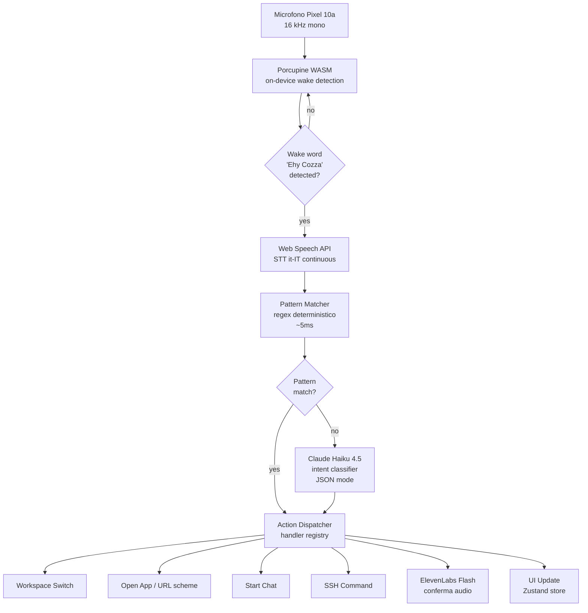

# 06 — Voice Commands & Workspaces — cozza-ai

> Documento di estensione architetturale e UX per **cozza-ai**.
> Autori: `ai-engineer` + `ux-ui-designer` + `senior-frontend-dev` (cross-functional).
> Data: 2026-05-01 — Versione 1.0
> Stato: APPROVED FOR IMPLEMENTATION (V1+V2)
> Riferimenti: `01-business-analysis.md`, `02-solution-architecture.md`, `03-ai-engineering.md`, `04-ux-design.md`, `05-roadmap.md`

---

## 1. Vision delle funzionalità vocali avanzate

### 1.1 Da "PWA chat AI" a "personal cockpit"

I doc 01-05 hanno definito una PWA voice-first che fa chat multi-modello, voice loop e launcher di app. È un MVP solido ma rimane reattivo: l'utente apre l'app, parla, riceve risposta. Il salto qualitativo che Cozza vuole è opposto — l'app deve diventare proattiva e ambient: non si "apre", è già lì, in ascolto, e basta dire "Ehy Cozza" perché si materializzi un cockpit specifico per quello che sto facendo (cucinare, lavorare, guardare un film, leggere, camminare).

Tre cambi di paradigma:

1. **Da app a OS personale**. L'interfaccia non è più una destinazione, è un contesto sempre disponibile. Il wake-word è il pulsante home. I workspace sono i desktop virtuali.
2. **Da text-first ad action-first**. Il voice non è solo input per la chat: è il dispatcher di intenti che possono aprire app native, lanciare comandi SSH, riorganizzare il layout, mettere in pausa media.
3. **Da single-layout a workspaces**. Il layout della UI non è uno solo: cambia in base allo scenario. Cucinare richiede pannelli grandi e voice-only; lavorare richiede ultrawide multi-pane; guardare un film richiede chrome-zero. Un comando vocale switcha il workspace in <300 ms.

### 1.2 Quattro principi guida

1. **Always on, privacy first** — il microfono è sempre acceso ma il rilevamento del wake-word è 100% on-device (Picovoice Porcupine WASM). Nessun audio sale al cloud finché non scatta "Ehy Cozza". Indicatore visivo permanente del mic attivo (puntino verde nel corner). Toggle "push-to-talk only" disponibile in settings per chi non si fida.
2. **Voice as primary, screen as canvas** — la voce è l'input principale, lo schermo è il foglio bianco che la voce dipinge. Tutte le azioni primarie sono raggiungibili a voce; touch e tastiera restano fallback equivalenti, mai privilegiati.
3. **Context-aware workspaces** — il sistema sa in che workspace sei, e sia il voice profile (verbosità del TTS) sia il system prompt del LLM si adattano. In "Studio" l'AI parla lentamente e in italiano formale; in "Lavoriamo" è concisa e tecnica; in "Ambient" risponde con frasi ≤8 parole.
4. **Fail soft to manual** — ogni comando vocale ha un equivalente touch. Se il wake-word non triggera, c'è il pulsante voice. Se l'intent classifier sbaglia, l'utente vede la trascrizione e può confermare/correggere. Mai un dead-end.

### 1.3 Diagramma high-level del flusso



Latency budget end-to-end target: pronuncia → azione visibile **< 1.8 s** sul 95° percentile. Wake-word ≤ 300 ms, STT 600-900 ms (dipende dalla lunghezza), pattern match 5-10 ms (oppure LLM 200-400 ms), dispatch + UI 100-200 ms.

---

## 2. Wake word "Ehy Cozza" — architettura

### 2.1 Scelta tecnologica

**Decisione: Picovoice Porcupine** (free tier per uso personale).

| Criterio | Porcupine | Vosk | Web Speech API continuous | Snowboy |
|---|---|---|---|---|
| Custom keyword | sì (Console online) | difficile | no, solo full STT | sì ma deprecato |
| Latency | <100 ms | 200-400 ms | 500+ ms (round trip) | <200 ms |
| Privacy on-device | sì (WASM) | sì | no (cloud) | sì |
| CPU continuativa | <5% | 15-25% | 20-30% | <10% |
| Battery impact | trascurabile | alto | molto alto | medio |
| Free per personal use | sì (3 keyword, 1 device) | sì | sì | progetto morto |
| Maturità WASM browser | maturo, SDK ufficiale | parziale | n/a | nullo |

**Vosk scartato**: il modello it-IT scaricabile pesa 50+ MB, troppo per una PWA, e il rilevamento keyword richiede di runnare l'STT completo continuamente (drena CPU). **Web Speech continuous scartato**: oltre al consumo, su Chrome Android ha un limite implicito di sessione (~60s) e ricomincia rumorosamente, oltre a inviare tutto il flusso al cloud Google. **Snowboy**: progetto archiviato dal 2020, niente più aggiornamenti.

**Procedura training "Ehy Cozza"**:

1. Crea account su `console.picovoice.ai` (gratis).
2. Sezione "Porcupine → Custom Wake Word".
3. Inserire la trascrizione `"Ehy Cozza"`, scegliere lingua **Italian**, target platform **Web (WASM)**.
4. Picovoice genera in <2 minuti il file `ehy-cozza_it_wasm_v3.ppn` (binary, ~5 KB).
5. Download del file `.ppn` + recupero `accessKey` personale.
6. Il `.ppn` viene committato in `public/voice/keywords/ehy-cozza_it.ppn`; l'`accessKey` finisce in `VITE_PICOVOICE_ACCESS_KEY` (env var del client, è sicuro perché il free tier è binding al device, non al key in chiaro).

Le 3 keyword del free tier permettono espansione futura: "Ehy Cozza" + "Stop" globale + un terzo a scelta (es. "Cinema").

### 2.2 Integrazione nel browser

Porcupine viene caricato in un **Web Worker dedicato** per evitare di bloccare il main thread; l'audio dal `getUserMedia` è instradato via `AudioWorklet` al worker. Esempio di hook React:

```ts
// src/hooks/useWakeWord.ts
import { useEffect, useRef, useState } from 'react';
import { PorcupineWorker } from '@picovoice/porcupine-web';
import { WebVoiceProcessor } from '@picovoice/web-voice-processor';
import ehyCozzaModel from '/voice/keywords/ehy-cozza_it.ppn?url';
import italianModel from '/voice/models/porcupine_params_it.pv?url';

type WakeStatus = 'idle' | 'loading' | 'listening' | 'paused' | 'error';

interface UseWakeWordResult {
  status: WakeStatus;
  lastDetectedAt: number | null;
  pause: () => Promise<void>;
  resume: () => Promise<void>;
}

export function useWakeWord(
  accessKey: string,
  onWake: () => void
): UseWakeWordResult {
  const [status, setStatus] = useState<WakeStatus>('idle');
  const [lastDetectedAt, setLastDetectedAt] = useState<number | null>(null);
  const workerRef = useRef<PorcupineWorker | null>(null);

  useEffect(() => {
    let cancelled = false;

    async function bootstrap(): Promise<void> {
      setStatus('loading');
      try {
        const worker = await PorcupineWorker.create(
          accessKey,
          [{ publicPath: ehyCozzaModel, label: 'ehy-cozza' }],
          (detection) => {
            if (cancelled) return;
            setLastDetectedAt(Date.now());
            onWake();
          },
          { publicPath: italianModel }
        );
        workerRef.current = worker;
        await WebVoiceProcessor.subscribe(worker);
        setStatus('listening');
      } catch (err) {
        console.error('[wake-word] init failed', err);
        setStatus('error');
      }
    }

    void bootstrap();
    return () => {
      cancelled = true;
      const w = workerRef.current;
      if (w) {
        WebVoiceProcessor.unsubscribe(w).catch(() => {});
        w.terminate();
      }
    };
  }, [accessKey, onWake]);

  const pause = async (): Promise<void> => {
    const w = workerRef.current;
    if (w) await WebVoiceProcessor.unsubscribe(w);
    setStatus('paused');
  };

  const resume = async (): Promise<void> => {
    const w = workerRef.current;
    if (w) await WebVoiceProcessor.subscribe(w);
    setStatus('listening');
  };

  return { status, lastDetectedAt, pause, resume };
}
```

**Microphone permission**: la prima volta che la PWA parte, mostra un modal didattico ("Per attivare 'Ehy Cozza' devi concedere il microfono. Nessun audio lascia il dispositivo finché non pronunci il wake word."). Salvataggio della preferenza in IndexedDB (`settings.voice.wakeWordEnabled`).

**Background suspension**: quando `document.visibilityState === 'hidden'` e l'app è in background da ≥30s, il worker viene messo in pause per risparmiare batteria; ripresa al `visibilitychange`. Il service worker NON tiene il mic acceso in background, perché questa è una PWA, non un app nativo, ed è sia tecnicamente impossibile (Chrome chiude i SW idle) sia eticamente scorretto.

### 2.3 Privacy

- **Zero audio in upload prima del wake-word**: il chunk audio viene processato esclusivamente nel Web Worker, mai inviato a un endpoint. L'STT cloud (Web Speech API) parte SOLO dopo il trigger.
- **Toggle privacy-mode** in settings: "Always-on listening" (default off al primo avvio, opt-in esplicito) vs "Push-to-talk only" (mic acceso solo tenendo premuto il pulsante voice o il ring-controller del Beast).
- **LED indicator GDPR-style**: pallino verde fisso nel corner top-right quando il mic è attivo (continuous listening), pallino rosso pulsante durante STT post-wake. Mai mic attivo senza indicatore visibile.
- **Audit log locale** in IndexedDB: ogni trigger del wake-word logga `{ timestamp, confidence, intent, durationMs }` — visibile nelle settings sotto "Voice activity log", consultabile e cancellabile dall'utente.
- **Niente analytics su audio**: nessun campione audio è mai loggato, nemmeno anonimizzato.

### 2.4 Performance budget

| Metrica | Target | Misurato come |
|---|---|---|
| Wake-word latency end-to-end (pronuncia → callback `onWake`) | <300 ms p95 | `performance.now()` deltas in dev console + logging |
| CPU continuativa (Worker idle listening) | <5% media su Pixel 10a | Chrome DevTools Performance + `chrome://tracing` |
| Memoria runtime worker | <40 MB | DevTools Memory profiler |
| Battery extra vs baseline (PWA aperta senza wake) | <3%/ora | Misurazione manuale con Battery Historian |
| False positive rate | <1 evento/ora in casa con TV accesa | Conteggio empirico settimanale per 4 settimane |
| False negative rate | <5% su 50 prove pulite | Test script "Ehy Cozza" ripetuto |

Se in produzione misuriamo numeri fuori dal budget, prima leva: ridurre `sensitivity` del Porcupine da 0.65 default a 0.5; seconda leva: limitare wake-word ai workspace dove ha senso (in "Cinema" potremmo disabilitarlo e affidarci solo al ring-controller).

---

## 3. STT post-wake (continuous dictation)

Dopo il trigger del wake-word, il sistema attiva la **Web Speech API** in modalità `continuous: true` con `interimResults: true`, lingua `it-IT`. Il flusso:

1. Porcupine emette `onWake` → si pausa il worker (per evitare doppi trigger e rumore tra mic e altoparlante).
2. Si avvia `SpeechRecognition` con `lang: 'it-IT'`.
3. Si suonano 80 ms di "earcon" (tono breve "tin") via Web Audio API per dare feedback udibile.
4. Si raccolgono chunk `interimResults` finché:
   - **Stop word**: la trascrizione interim contiene `/\b(fine|stop|basta)\b/i` → terminate immediato.
   - **Silenzio prolungato**: 2.0 s senza nuovo interim → terminate.
   - **Timeout assoluto**: 12 s → terminate forzato (per evitare sessioni infinite).
5. Sul `final` evento si inoltra la trascrizione al pattern matcher.

```ts
// src/hooks/useVoiceCapture.ts
import { useCallback, useRef, useState } from 'react';

type CaptureState = 'idle' | 'listening' | 'finalizing' | 'error';
type CaptureResult = { transcript: string; confidence: number };

const STOP_WORDS = /\b(fine|stop|basta|annulla)\b/i;
const SILENCE_MS = 2000;
const HARD_TIMEOUT_MS = 12000;

export function useVoiceCapture(
  onResult: (r: CaptureResult) => void,
  onCancel: () => void
) {
  const [state, setState] = useState<CaptureState>('idle');
  const recogRef = useRef<SpeechRecognition | null>(null);
  const silenceTimerRef = useRef<number | null>(null);
  const hardTimerRef = useRef<number | null>(null);

  const stop = useCallback((reason: 'final' | 'cancel') => {
    if (silenceTimerRef.current) clearTimeout(silenceTimerRef.current);
    if (hardTimerRef.current) clearTimeout(hardTimerRef.current);
    recogRef.current?.stop();
    setState('idle');
    if (reason === 'cancel') onCancel();
  }, [onCancel]);

  const start = useCallback(() => {
    const SR = (window as any).SpeechRecognition ?? (window as any).webkitSpeechRecognition;
    if (!SR) {
      setState('error');
      return;
    }
    const recognition: SpeechRecognition = new SR();
    recognition.lang = 'it-IT';
    recognition.continuous = true;
    recognition.interimResults = true;

    recognition.onresult = (event) => {
      const last = event.results[event.results.length - 1];
      const text = last[0].transcript.trim();
      const confidence = last[0].confidence ?? 0.7;

      if (silenceTimerRef.current) clearTimeout(silenceTimerRef.current);
      silenceTimerRef.current = window.setTimeout(
        () => stop('final'),
        SILENCE_MS
      );

      if (STOP_WORDS.test(text)) {
        stop('cancel');
        return;
      }

      if (last.isFinal) {
        if (confidence < 0.55) {
          // bassa confidence → chiedi conferma all'utente via UI
          onResult({ transcript: text, confidence });
        } else {
          onResult({ transcript: text, confidence });
        }
        stop('final');
      }
    };

    recognition.onerror = () => setState('error');
    recognition.onend = () => setState('idle');

    recognition.start();
    recogRef.current = recognition;
    setState('listening');

    hardTimerRef.current = window.setTimeout(() => stop('cancel'), HARD_TIMEOUT_MS);
  }, [onResult, stop]);

  return { state, start, stop };
}
```

**Confidence fallback**: se la confidence dell'ultimo final result è <0.55 oppure la trascrizione è vuota, la UI mostra un toast con la trascrizione interpretata e due bottoni: "Sì, vai" (esegui comunque) e "No, riprova" (riavvia capture). Su Beast, gli stessi due bottoni sono mappati a comandi vocali immediati ("sì"/"no").

---

## 4. Intent classification system

### 4.1 Approccio ibrido

Il sistema utilizza due layer in cascata:

- **Layer 1 — Pattern matching deterministico** (latency 5-10 ms). Una tabella di regex copre il 90% dei comandi tipici. Vince sempre se matcha (zero costo, latency irrisoria, prevedibile).
- **Layer 2 — LLM fallback** (latency 200-400 ms). Se nessun pattern matcha o se la confidence regex è ambigua, la frase viene mandata a `claude-haiku-4-5` con un system prompt che la classifica in JSON strutturato.

```ts
// src/voice/intentClassifier.ts
import type { Intent, IntentParams } from './types';

interface PatternRule {
  intent: Intent;
  pattern: RegExp;
  extract?: (m: RegExpMatchArray) => IntentParams;
}

const RULES: PatternRule[] = [
  {
    intent: 'OPEN_APP',
    pattern: /\bmett(?:i|imi)?\s+(netflix|dazn|now|spotify|youtube|prime|disney)\b/i,
    extract: (m) => ({ app: m[1].toLowerCase() }),
  },
  {
    intent: 'SWITCH_WORKSPACE',
    pattern: /\b(lavoriamo|cinema|studio|casual|ambient)\b/i,
    extract: (m) => ({ workspace: m[1].toLowerCase() }),
  },
  {
    intent: 'STOP',
    pattern: /\b(stop|ferma|silenzio|zitt[oa]|pausa)\b/i,
  },
  {
    intent: 'READ_LAST',
    pattern: /\brileg(?:gi|gimi)\s+(?:ultim[ao]|risposta)\b/i,
  },
  {
    intent: 'SUMMARIZE',
    pattern: /\briassum(?:i|imi)\b/i,
  },
  {
    intent: 'START_CHAT',
    pattern: /\b(?:chiedi(?:lo)?\s+a\s+)?(claude|gpt|chat\s*gpt)\b/i,
    extract: (m) => ({ model: m[1].toLowerCase().replace(/\s+/g, '') }),
  },
  // ... altre 15+ regole
];

export interface IntentResult {
  intent: Intent;
  params: IntentParams;
  confidence: number;
  source: 'pattern' | 'llm';
  fallbackText: string;
}

export async function classifyIntent(
  transcript: string,
  llmFallback: (text: string) => Promise<IntentResult>
): Promise<IntentResult> {
  const text = transcript.trim();
  for (const rule of RULES) {
    const match = text.match(rule.pattern);
    if (match) {
      return {
        intent: rule.intent,
        params: rule.extract ? rule.extract(match) : {},
        confidence: 0.95,
        source: 'pattern',
        fallbackText: 'Ok',
      };
    }
  }
  return llmFallback(text);
}
```

### 4.2 Catalogo intent supportati (V1+V2)

| Intent | Esempio frase | Params | Phase |
|---|---|---|---|
| `OPEN_APP` | "metti Netflix" | `{ app: 'netflix' \| 'dazn' \| 'now' \| 'spotify' \| 'youtube' \| 'prime' \| 'disney' }` | V1 |
| `SWITCH_WORKSPACE` | "lavoriamo", "cinema" | `{ workspace: 'casual' \| 'lavoriamo' \| 'cinema' \| 'studio' \| 'ambient' }` | V1 |
| `START_CHAT` | "chiedi a Claude" | `{ model?: 'claude' \| 'gpt' }` | V1 |
| `OPEN_TERMINAL` | "apri terminale" | `{ host?: 'pc-casa' }` | V1 |
| `OPEN_VSCODE` | "apri editor" | `{ project?: string }` | V1 |
| `PLAY_MEDIA` | "metti musica jazz" | `{ query: string, source?: 'spotify' \| 'youtube' }` | V2 |
| `STOP` | "stop", "basta" | `{}` | V1 |
| `PAUSE` | "pausa" | `{}` | V1 |
| `READ_LAST` | "rileggimi l'ultima" | `{}` | V1 |
| `SUMMARIZE` | "riassumi la chat" | `{ scope?: 'session' \| 'last10' }` | V1 |
| `TIME_QUERY` | "che ore sono" | `{}` | V1 |
| `WEATHER_QUERY` | "che tempo fa" | `{ location?: string }` | V2 |
| `CALENDAR_QUERY` | "cosa ho oggi" | `{ scope?: 'today' \| 'week' }` | V2 |
| `MAIL_CHECK` | "leggi mail" | `{ unreadOnly?: boolean }` | V2 |
| `VOLUME_UP` | "alza volume" | `{ delta?: number }` | V1 |
| `VOLUME_DOWN` | "abbassa volume" | `{ delta?: number }` | V1 |
| `BRIGHTNESS` | "luminosità 50" | `{ level?: number }` | V2 |
| `SCREENSHOT` | "screenshot" | `{}` | V2 |
| `SHARE` | "condividi" | `{ target?: string }` | V2 |
| `EXIT_APP` | "esci", "chiudi tutto" | `{}` | V1 |
| `RUN_SSH_CMD` | "esegui i test" | `{ command: string, host: string }` | V2 |
| `RELOAD_PREVIEW` | "ricarica preview" | `{}` | V2 |

### 4.3 LLM intent classifier prompt

Quando il pattern matcher fallisce, si chiama `claude-haiku-4-5` via il proxy Cloudflare Worker. Si usa la modalità **JSON output** (response prefill `{`) per garantire parsing deterministico.

```ts
const INTENT_SYSTEM_PROMPT = `Sei un classificatore di intenti vocali per cozza-ai, una PWA personale.
L'utente parla italiano. Devi mappare la sua frase a uno degli intent supportati e restituire SOLO un JSON valido.

INTENT SUPPORTATI:
- OPEN_APP: aprire app multimediale (netflix, dazn, now, spotify, youtube, prime, disney)
- SWITCH_WORKSPACE: cambiare layout (casual, lavoriamo, cinema, studio, ambient)
- START_CHAT: avviare conversazione AI (model: claude, gpt)
- OPEN_TERMINAL: aprire terminale SSH al PC casa
- OPEN_VSCODE: aprire vscode.dev
- PLAY_MEDIA: riprodurre brano/video specifico
- STOP / PAUSE: fermare riproduzione o TTS
- READ_LAST: rileggere ultima risposta AI
- SUMMARIZE: riassumere conversazione
- TIME_QUERY / WEATHER_QUERY / CALENDAR_QUERY / MAIL_CHECK
- VOLUME_UP / VOLUME_DOWN / BRIGHTNESS
- SCREENSHOT / SHARE / EXIT_APP
- RUN_SSH_CMD / RELOAD_PREVIEW
- UNKNOWN: se nessuno matcha

OUTPUT FORMAT (rigorosamente JSON, niente markdown):
{
  "intent": "OPEN_APP",
  "params": { "app": "netflix" },
  "confidence": 0.0-1.0,
  "fallback_text": "frase italiana <8 parole da pronunciare come conferma"
}

Esempi:
"butta su un film" → {"intent":"SWITCH_WORKSPACE","params":{"workspace":"cinema"},"confidence":0.7,"fallback_text":"Cinema attivo"}
"facciamo qualcosa di lavoro" → {"intent":"SWITCH_WORKSPACE","params":{"workspace":"lavoriamo"},"confidence":0.75,"fallback_text":"Workspace lavoro"}
"non ho capito" → {"intent":"UNKNOWN","params":{},"confidence":0.3,"fallback_text":"Non ho capito"}

Restituisci SOLO il JSON, niente prefisso, niente markdown fence.`;

async function llmClassify(transcript: string): Promise<IntentResult> {
  const response = await fetch('/api/intent/classify', {
    method: 'POST',
    headers: { 'content-type': 'application/json' },
    body: JSON.stringify({
      system: INTENT_SYSTEM_PROMPT,
      user: transcript,
      model: 'claude-haiku-4-5',
      maxTokens: 200,
    }),
  });
  const data = await response.json();
  return { ...data, source: 'llm' as const };
}
```

Costi attesi: 5-10 fallback al giorno × ~250 token in/out = ~3 k token/giorno = trascurabile (< 0.10 €/mese sulla pricing Haiku).

---

## 5. Action Dispatcher

### 5.1 Architettura

Il dispatcher è un registry tipizzato che mappa ogni `Intent` a un handler. Nuovi intent si registrano dichiarativamente; mai `switch` giganti.

```ts
// src/voice/dispatcher.ts
import type { Intent, IntentParams, IntentResult } from './types';
import { useWorkspaceStore } from '@/stores/workspaceStore';
import { useChatStore } from '@/stores/chatStore';
import { speakConfirmation } from '@/voice/tts';
import { launchApp } from '@/launchers/appLauncher';
import { sshExecute } from '@/integrations/ssh';

type Handler = (params: IntentParams, ctx: DispatchContext) => Promise<DispatchOutcome>;
type DispatchContext = { transcript: string; confidence: number };
type DispatchOutcome = { ok: boolean; spoken?: string; error?: string };

const handlers: Partial<Record<Intent, Handler>> = {
  OPEN_APP: async (params) => {
    const result = await launchApp(params.app as string);
    return { ok: result.launched, spoken: result.launched ? `Apro ${params.app}` : `Non trovo ${params.app}` };
  },

  SWITCH_WORKSPACE: async (params) => {
    const ws = params.workspace as string;
    useWorkspaceStore.getState().switchTo(ws);
    return { ok: true, spoken: `Workspace ${ws} attivo` };
  },

  START_CHAT: async (params) => {
    const model = (params.model as string) ?? 'claude';
    useChatStore.getState().startNewSession({ provider: model });
    return { ok: true, spoken: `Pronto con ${model}` };
  },

  STOP: async () => {
    speakConfirmation.cancel();
    useChatStore.getState().abortStreaming();
    return { ok: true };
  },

  READ_LAST: async () => {
    const last = useChatStore.getState().lastAssistantMessage();
    if (!last) return { ok: false, spoken: 'Niente da rileggere' };
    await speakConfirmation.speak(last.content);
    return { ok: true };
  },

  RUN_SSH_CMD: async (params) => {
    const out = await sshExecute(params.command as string, params.host as string ?? 'pc-casa');
    return { ok: out.exitCode === 0, spoken: out.exitCode === 0 ? 'Eseguito' : 'Errore' };
  },
};

export async function executeIntent(result: IntentResult): Promise<DispatchOutcome> {
  const handler = handlers[result.intent];
  if (!handler) {
    return { ok: false, spoken: 'Comando non supportato' };
  }
  try {
    const outcome = await handler(result.params, {
      transcript: result.fallbackText,
      confidence: result.confidence,
    });
    if (outcome.spoken) {
      void speakConfirmation.speak(outcome.spoken);
    }
    return outcome;
  } catch (err) {
    console.error('[dispatcher] error', err);
    return { ok: false, error: (err as Error).message, spoken: 'Errore esecuzione' };
  }
}
```

### 5.2 Launch app native via URL scheme Android

Su Android Chrome, una PWA può lanciare app native sfruttando gli `intent://` URI o gli URL scheme proprietari. Tabella mapping:

| App | Intent URI Android | Web URL fallback |
|---|---|---|
| Netflix | `intent://www.netflix.com/#Intent;package=com.netflix.mediaclient;scheme=https;end` | `https://www.netflix.com` |
| DAZN | `intent://open.dazn.com/#Intent;package=com.dazn;scheme=https;end` | `https://www.dazn.com` |
| NOW | `intent://nowtv.it/#Intent;package=it.sky.nowtv;scheme=https;end` | `https://www.nowtv.it` |
| Spotify | `spotify://` (deep link nativo) | `https://open.spotify.com` |
| YouTube | `vnd.youtube://` | `https://www.youtube.com` |
| Prime Video | `intent://www.primevideo.com/#Intent;package=com.amazon.avod.thirdpartyclient;scheme=https;end` | `https://www.primevideo.com` |
| Disney+ | `intent://www.disneyplus.com/#Intent;package=com.disney.disneyplus;scheme=https;end` | `https://www.disneyplus.com` |

```ts
// src/launchers/appLauncher.ts
const APP_REGISTRY: Record<string, { intent: string; web: string }> = {
  netflix: {
    intent: 'intent://www.netflix.com/#Intent;package=com.netflix.mediaclient;scheme=https;end',
    web: 'https://www.netflix.com',
  },
  spotify: { intent: 'spotify://', web: 'https://open.spotify.com' },
  // ...
};

export async function launchApp(name: string): Promise<{ launched: boolean }> {
  const entry = APP_REGISTRY[name.toLowerCase()];
  if (!entry) return { launched: false };

  const isAndroid = /Android/i.test(navigator.userAgent);
  const url = isAndroid ? entry.intent : entry.web;

  // Tentativo intent; fallback dopo 600 ms se la pagina è ancora visibile
  const opened = window.open(url, '_blank');
  if (isAndroid) {
    setTimeout(() => {
      if (document.visibilityState === 'visible') {
        window.location.href = entry.web;
      }
    }, 600);
  }
  return { launched: opened !== null };
}
```

---

## 6. Workspaces system

### 6.1 Concept

Un **Workspace** è un layout JSON che descrive: pannelli attivi, posizione/dimensione, componenti embed, voice profile, color theme, glasses mode (3DoF anchor o follow). Switching tra workspace è un'azione di prima classe (voce, touch, scorciatoia).

I **5 workspace built-in** (V1 ne porta 3, V2 li completa):

#### Casual (V1, default)
Home dashboard. Hero con waveform voice, sotto griglia di tile launcher (Netflix, DAZN, Spotify, vscode, terminal, chat) e in basso una status bar minimale. Voice profile "concise". È quello che parte se non si specifica nulla.

#### Lavoriamo (V1, deep dive in §7)
Layout 32:9 ultrawide multi-pane: vscode.dev a sinistra, ChatBubble Claude a destra in alto, iframe browser preview in basso a destra. Voice profile "concise". Theme "oled-cool".

#### Cinema (V1)
Fullscreen launcher media. Niente chat visibile. Sei tile poster (Netflix, DAZN, NOW, Prime, Disney+, YouTube) grandi 30vh × 20vw, con focus ring per ring-controller. Voice profile "silent" (no TTS automatico per non interferire con la visione). Theme "oled-deep".

#### Studio (V2)
Reading mode tipo Pocket. Singola colonna 720 px max-width centrata, font Inter 22px, line-height 1.7. Sotto, una ChatBubble compatta in italiano voice-first. Pensato per "leggimi questo articolo" o "spiegami questo concetto". Voice profile "reading" (TTS voce italiana lenta, prosodica). Theme "oled-warm".

#### Ambient (V2)
UI minima: solo waveform centrale al 30% dello schermo, nient'altro. Pensato per camminare con i Beast. Voice-first hands-free puro. Voice profile "concise" + frasi ≤8 parole forzate via system prompt. Theme "oled-deep" + dimming a -50%.

### 6.2 Architettura

State management con **Zustand** (coerente con doc 02):

```ts
// src/stores/workspaceStore.ts
import { create } from 'zustand';
import { persist } from 'zustand/middleware';

export type WorkspaceId = 'casual' | 'lavoriamo' | 'cinema' | 'studio' | 'ambient';
export type GlassesMode = '3dof-anchor' | '3dof-follow' | '0dof';
export type VoiceProfile = 'concise' | 'reading' | 'silent';
export type Theme = 'oled-deep' | 'oled-warm' | 'oled-cool';
export type LayoutKind = 'single' | 'split' | 'tri' | 'quad';

export interface Pane {
  id: string;
  kind: 'chat' | 'editor' | 'preview' | 'launcher' | 'reader' | 'waveform' | 'terminal';
  size: number;        // 0..1, frazione dell'area assegnata
  position: 'left' | 'right' | 'top' | 'bottom' | 'center';
  config?: Record<string, unknown>;
}

export interface WorkspaceConfig {
  id: WorkspaceId;
  name: string;
  layout: LayoutKind;
  panes: Pane[];
  voiceProfile: VoiceProfile;
  theme: Theme;
  glassesMode: GlassesMode;
}

interface WorkspaceStore {
  current: WorkspaceId;
  configs: Record<WorkspaceId, WorkspaceConfig>;
  history: WorkspaceId[];
  switchTo: (id: WorkspaceId) => void;
  switchBack: () => void;
}

const DEFAULTS: Record<WorkspaceId, WorkspaceConfig> = {
  casual: {
    id: 'casual', name: 'Casual', layout: 'single',
    panes: [
      { id: 'hero', kind: 'waveform', size: 0.35, position: 'top' },
      { id: 'tiles', kind: 'launcher', size: 0.50, position: 'center' },
      { id: 'chat', kind: 'chat', size: 0.15, position: 'bottom' },
    ],
    voiceProfile: 'concise', theme: 'oled-deep', glassesMode: '3dof-follow',
  },
  lavoriamo: {
    id: 'lavoriamo', name: 'Lavoriamo', layout: 'tri',
    panes: [
      { id: 'editor', kind: 'editor', size: 0.60, position: 'left' },
      { id: 'chat', kind: 'chat', size: 0.25, position: 'right' },
      { id: 'preview', kind: 'preview', size: 0.15, position: 'bottom' },
    ],
    voiceProfile: 'concise', theme: 'oled-cool', glassesMode: '3dof-anchor',
  },
  cinema: {
    id: 'cinema', name: 'Cinema', layout: 'single',
    panes: [{ id: 'launcher', kind: 'launcher', size: 1, position: 'center' }],
    voiceProfile: 'silent', theme: 'oled-deep', glassesMode: '3dof-anchor',
  },
  studio: {
    id: 'studio', name: 'Studio', layout: 'split',
    panes: [
      { id: 'reader', kind: 'reader', size: 0.75, position: 'top' },
      { id: 'chat', kind: 'chat', size: 0.25, position: 'bottom' },
    ],
    voiceProfile: 'reading', theme: 'oled-warm', glassesMode: '3dof-anchor',
  },
  ambient: {
    id: 'ambient', name: 'Ambient', layout: 'single',
    panes: [{ id: 'waveform', kind: 'waveform', size: 1, position: 'center' }],
    voiceProfile: 'concise', theme: 'oled-deep', glassesMode: '3dof-follow',
  },
};

export const useWorkspaceStore = create<WorkspaceStore>()(
  persist(
    (set, get) => ({
      current: 'casual',
      configs: DEFAULTS,
      history: [],
      switchTo: (id) => {
        const prev = get().current;
        set({ current: id, history: [...get().history, prev].slice(-10) });
      },
      switchBack: () => {
        const h = get().history;
        if (h.length === 0) return;
        const prev = h[h.length - 1];
        set({ current: prev, history: h.slice(0, -1) });
      },
    }),
    { name: 'cozza-workspace' }
  )
);
```

Transizione visiva: `framer-motion` con `AnimatePresence` su un wrapper di livello root, fade-out 150 ms + fade-in 150 ms, totale 300 ms. Nessuno scroll bounce, nessun blur (consuma GPU).

### 6.3 Wireframe ASCII

**Casual**
```
+================================================================+
|  cozza-ai                                       [mic ON] [13:42]|
|----------------------------------------------------------------|
|                                                                |
|              ~~~~~~~~~~  WAVEFORM VOICE  ~~~~~~~~~             |
|                                                                |
|----------------------------------------------------------------|
|  +-----+   +-----+   +-----+   +-----+   +-----+   +-----+    |
|  | NFX |   | DAZN|   | SPOT|   | YT  |   | PRIME |   | DSN+|  |
|  +-----+   +-----+   +-----+   +-----+   +-----+   +-----+    |
|  +-----+   +-----+   +-----+                                  |
|  |VSCD |   |TERM |   | CHAT|                                  |
|  +-----+   +-----+   +-----+                                  |
|----------------------------------------------------------------|
| > "Ehy Cozza, lavoriamo"                            [casual]   |
+================================================================+
```

**Lavoriamo (32:9 ultrawide)**
```
+================================================================================+
|  cozza-ai · lavoriamo · progetto: cozza-ai                  [mic ON] [13:42]   |
|--------------------------------------------------------------------------------|
|                                                  |                             |
|                                                  |   CLAUDE · sonnet-4-6       |
|                                                  |                             |
|     vscode.dev (iframe)                          |   > Ho aggiornato il file.. |
|     ?folder=ssh://pc-casa/work/cozza-ai          |                             |
|                                                  |   < Ehy Cozza, esegui i     |
|     [editor monaco]                              |     test                    |
|                                                  |                             |
|                                                  |   > Eseguo: pnpm test       |
|                                                  |--->-----------------------  |
|                                                  |   PREVIEW · :5173           |
|                                                  |   +------------------+     |
|                                                  |   |   live preview   |     |
|                                                  |   +------------------+     |
|--------------------------------------------------------------------------------|
| build: ok · last: 2s ago · ssh: pc-casa @ 100.x.y.z                           |
+================================================================================+
^------- 60% editor ---------^------ 25% chat -------^---- 15% preview ----------^
```

**Cinema**
```
+================================================================+
|                                                                |
|   +------------+  +------------+  +------------+              |
|   |            |  |            |  |            |              |
|   |  NETFLIX   |  |    DAZN    |  |    NOW     |              |
|   |            |  |            |  |            |              |
|   +------------+  +------------+  +------------+              |
|                                                                |
|   +------------+  +------------+  +------------+              |
|   |            |  |            |  |            |              |
|   |   PRIME    |  |  DISNEY+   |  |  YOUTUBE   |              |
|   |            |  |            |  |            |              |
|   +------------+  +------------+  +------------+              |
|                                                                |
+================================================================+
```

**Studio**
```
+================================================================+
|              cozza-ai · studio                   [13:42]       |
|----------------------------------------------------------------|
|                                                                |
|        +----------------------------------+                    |
|        |  L'INTELLIGENZA ARTIFICIALE      |                    |
|        |  COME OS PERSONALE               |                    |
|        |                                  |                    |
|        |  Lorem ipsum dolor sit amet,     |                    |
|        |  consectetur adipiscing elit.    |                    |
|        |  Sed do eiusmod tempor...        |                    |
|        |                                  |                    |
|        |  [body 22px, max 720px]          |                    |
|        +----------------------------------+                    |
|                                                                |
|----------------------------------------------------------------|
| > Ehy Cozza, leggimi questo articolo                          |
+================================================================+
```

**Ambient**
```
+================================================================+
|                                                                |
|                                                                |
|                                                                |
|                  ~ ~ ~ ~ ~ ~ ~ ~ ~ ~ ~                         |
|                                                                |
|                                                                |
|                                                                |
+================================================================+
```

### 6.4 Workspace switching via voce

Trigger: pattern matcher cattura "lavoriamo" / "cinema" / "studio" / "casual" / "ambient" → emette `SWITCH_WORKSPACE` → handler chiama `useWorkspaceStore.getState().switchTo(id)`. Effetti collaterali specifici:

- **lavoriamo**: side-effect aggiuntivi — apri ultima sessione progetto da `IndexedDB.lastProject`, instaura tunnel SSH (se non già aperto), invia `tmux attach` come comando iniziale al pane terminal.
- **cinema**: aumenta dimming del Beast a -30% (via `BeastDeviceAPI.setDimming(0.3)` se disponibile, altrimenti CSS overlay), disattiva Porcupine (per evitare false positive durante il film), abilita ring-controller come unico input.
- **studio**: carica voce ElevenLabs "Sara - reading" con stability 0.75 (più prosodica), system prompt aggiunge "rispondi in italiano formale, frasi lunghe, lente, con pause".
- **ambient**: forza voice profile "concise", system prompt aggiunge "MAX 8 parole per risposta".

Conferma audio: `speakConfirmation.speak("Workspace lavoro attivo")` via ElevenLabs Flash v2.5 (TTFB ~200 ms). In Cinema e Ambient, conferma è solo visiva (toast 1 s).

---

## 7. Workspace "Lavoriamo" — deep dive

È il workspace più complesso e quello con maggior valore quotidiano. Dettaglio implementativo:

### 7.1 Layout 32:9

```
+--------- 60% editor ---------+--- 25% chat ---+- 15% preview -+
|                              |                |                |
|       vscode.dev iframe      |  ChatBubble    |   browser      |
|                              |  Claude        |   iframe       |
|                              |                |                |
+------------------------------+----------------+----------------+
```

CSS Grid:

```css
.workspace-lavoriamo {
  display: grid;
  grid-template-columns: 60fr 25fr 15fr;
  grid-template-rows: 70fr 30fr;
  grid-template-areas:
    "editor chat preview"
    "editor chat preview";
  height: 100vh;
  background: #000;
}
```

### 7.2 Pannello editor (vscode.dev embedded)

```html
<iframe
  src={`https://vscode.dev/?folder=vscode-remote://ssh-remote+pc-casa/work/${activeProject}`}
  allow="clipboard-read; clipboard-write; cross-origin-isolated"
  sandbox="allow-scripts allow-same-origin allow-forms allow-popups"
  loading="lazy"
/>
```

**Limite tecnico noto**: `vscode.dev` ha CSP rigorose (`frame-ancestors 'self'`) che potenzialmente bloccano l'embedding. **Mitigation**: se il blocco è confermato in test, fallback a **code-server** self-hosted sul PC casa via Tailscale (`https://pc-casa.tailnet.ts.net:8443`), che è completamente embedabile perché lo configuriamo noi.

### 7.3 Pannello chat (system prompt context-aware)

```ts
const LAVORIAMO_SYSTEM_PROMPT = `Sei l'assistente coding di Cozza nel workspace "Lavoriamo".
Contesto attivo:
- Progetto: ${ctx.projectName}
- File aperto: ${ctx.activeFile}
- Branch git: ${ctx.gitBranch}
- Ultimo errore terminale: ${ctx.lastError ?? 'nessuno'}

Regole:
- Risposte concise (<150 parole salvo richiesto altrimenti)
- Codice in TypeScript strict
- Mai inventare API: se non sicuro, chiedi
- Quando fornisci comandi shell, anteponi "ssh pc-casa" se devono girare sul PC casa`;
```

### 7.4 Pannello preview

`<iframe src="http://pc-casa.tailnet.ts.net:5173" />` punta al dev server Vite del progetto attivo, accessibile via Tailscale magic DNS.

Hot-reload trigger: il pane preview espone un pulsante "ricarica" (touch) e un comando voce "ricarica preview" che esegue `iframeRef.current?.contentWindow?.location.reload()`.

### 7.5 Comandi vocali specifici di Lavoriamo

| Frase | Intent | Azione |
|---|---|---|
| "mostrami il file X" | `OPEN_VSCODE` | postMessage al pane editor → comando `workbench.action.quickOpen` con argomento X |
| "esegui i test" | `RUN_SSH_CMD` | SSH `cd $project && pnpm test` |
| "ricarica la preview" | `RELOAD_PREVIEW` | reload iframe preview |
| "commit con messaggio Y" | `RUN_SSH_CMD` | SSH `git commit -am "Y"` (con conferma) |
| "spiegami questa funzione" | `START_CHAT` | invia al chat pane il contenuto del file attivo + selezione |

---

## 8. Nuovi user stories — EPIC-9, EPIC-10, EPIC-11

### EPIC-9 — Wake Word & Always-Listen

- **US-9.1** Come Cozza, voglio che dicendo "Ehy Cozza" l'app si attivi senza toccare nulla, perché ho le mani impegnate quando cucino o cammino.
- **US-9.2** Come Cozza, voglio un indicatore visivo permanente quando il mic è attivo, perché la trasparenza sulla privacy è fondamentale.
- **US-9.3** Come Cozza, voglio poter disattivare il wake-word con un toggle in settings, perché in alcuni contesti (riunioni Zoom) non lo voglio attivo.
- **US-9.4** Come Cozza, voglio che il wake-word non scarichi più del 3% extra di batteria/ora, perché uso il phone tutto il giorno.
- **US-9.5** Come Cozza, voglio che il wake-word funzioni offline, perché spesso sono in metro o in posti senza rete.
- **US-9.6** Come Cozza, voglio un log accessibile di tutti i trigger del wake-word, perché voglio poter verificare cosa sta facendo l'app.

### EPIC-10 — Voice Command Dispatch

- **US-10.1** Come Cozza, voglio dire "Ehy Cozza, metti Netflix" e vedere Netflix aperto in <2 secondi, perché il valore è nella velocità.
- **US-10.2** Come Cozza, voglio che il sistema riconosca i miei comandi anche con frasi naturali tipo "buttami su un film", non solo formule rigide, perché parlo come parlo.
- **US-10.3** Come Cozza, voglio che se il sistema non capisce mi mostri la trascrizione e mi chieda conferma, perché preferisco confermare che vedere azioni sbagliate.
- **US-10.4** Come Cozza, voglio una stop word ("basta", "stop") che interrompa qualunque cosa, perché serve un freno d'emergenza.
- **US-10.5** Come Cozza, voglio che le conferme audio siano brevi (≤5 parole), perché le voglio non invasive.
- **US-10.6** Come Cozza, voglio poter usare la voce per controllare volume e luminosità, perché sui Beast non ho tasti fisici comodi.

### EPIC-11 — Workspaces & Layouts

- **US-11.1** Come Cozza, voglio dire "Ehy Cozza, lavoriamo" e ritrovarmi con vscode + chat + preview pronti, perché voglio annullare il "boot time mentale" del setup.
- **US-11.2** Come Cozza, voglio che il workspace ricordi l'ultimo progetto su cui stavo lavorando, perché continuo da dove ho lasciato senza pensarci.
- **US-11.3** Come Cozza, voglio un workspace "Cinema" che dia priorità ai contenuti video e nasconda l'UI, perché quando guardo un film non voglio distrazioni.
- **US-11.4** Come Cozza, voglio un workspace "Studio" con tipografia da lettura e voice TTS lenta, perché lo uso per articoli lunghi camminando.
- **US-11.5** Come Cozza, voglio un workspace "Ambient" minimale per quando cammino, perché l'unica cosa che mi serve è la voce, non lo schermo.
- **US-11.6** Come Cozza, voglio che ogni workspace abbia il proprio voice profile (verbosità del TTS), perché in lettura voglio frasi lunghe ma in cucina voglio risposte di 5 parole.

---

## 9. Nuovi requisiti funzionali (RF-029 → RF-050)

| ID | Requisito | Priorità | Testabilità |
|---|---|---|---|
| RF-029 | Il sistema deve rilevare il wake-word "Ehy Cozza" 100% on-device via Picovoice Porcupine WASM | P0 | trigger Porcupine 50/50 prove pulite |
| RF-030 | Latency wake-word (pronuncia → callback) <300 ms p95 | P0 | logging timing + report |
| RF-031 | Indicatore visivo permanente quando il mic è attivo | P0 | ispezione UI |
| RF-032 | Toggle "Always-on" / "Push-to-talk only" in settings, persistito in IndexedDB | P0 | toggle on/off + reload |
| RF-033 | Audit log locale dei trigger wake-word in IndexedDB, accessibile da settings | P1 | trigger 3 volte → 3 record |
| RF-034 | STT post-wake in lingua `it-IT` con auto-stop a 2 s di silenzio | P0 | misurare interim duration |
| RF-035 | Stop word ("fine", "stop", "basta") interrompe immediatamente STT e TTS | P0 | test integrazione |
| RF-036 | Confidence <0.55 mostra trascrizione e chiede conferma | P1 | mock confidence |
| RF-037 | Pattern matcher deterministico copre ≥20 intent | P0 | unit test 20 frasi |
| RF-038 | Fallback LLM (Claude Haiku) se nessun pattern matcha, output JSON valido | P0 | unit test contract |
| RF-039 | Action dispatcher tipizzato con handler registry per ogni intent | P0 | type-check + 5 handler unit-test |
| RF-040 | Launch app native via Android intent URI con fallback Web URL | P0 | test E2E su Android |
| RF-041 | 5 workspace built-in: casual, lavoriamo, cinema, studio, ambient | P0 (V1: 3, V2: 5) | render snapshot |
| RF-042 | Switch workspace via comando voce in <500 ms percepiti | P0 | misurazione |
| RF-043 | Ogni workspace ha voice profile, theme, glasses mode propri | P1 | config snapshot |
| RF-044 | Workspace "Lavoriamo" embed vscode.dev o code-server fallback | P0 V1 | iframe load |
| RF-045 | Workspace "Lavoriamo" embed iframe preview Vite dev server via Tailscale | P0 V1 | iframe load |
| RF-046 | Workspace "Lavoriamo" ChatBubble con system prompt context-aware (progetto + file aperto) | P1 | injection check |
| RF-047 | Comando voce "esegui i test" gira pnpm test via SSH | P1 V2 | E2E con PC casa |
| RF-048 | Conferma audio TTS ElevenLabs Flash, frase ≤8 parole | P1 | char count |
| RF-049 | Workspace persisti in IndexedDB, ripristino al reload | P0 | reload test |
| RF-050 | Comandi voce per volume +/- e luminosità, fallback Web Audio API | P2 V2 | manual test |

---

## 10. Aggiornamento al roadmap

### MVP (W1-W2, ~20h) — INVARIATO
Nessun wake-word, nessun workspace. Si rimane sul perimetro di doc 05: chat AI multi-modello + voice loop + PWA installabile. **Ma**: si lasciano hooks architetturali pronti per V1.

Hooks da seminare già nel MVP:
- `useWorkspaceStore` Zustand già presente, con un solo workspace `casual` configurato.
- Component root wrappato in `<WorkspaceShell>` che legge `current` dallo store (oggi sempre `casual`).
- Folder `src/voice/` creato con file stub `intentClassifier.ts`, `dispatcher.ts`, `wakeWord.ts` (export `noop`).
- Tipi `Intent`, `IntentResult`, `WorkspaceConfig` definiti.

Costo: ~1 ora aggiuntiva nel MVP, beneficio: evita refactor invasivo in V1.

### V1 (W3-W6, ~40h) — ESTESO
Aggiunte rispetto al doc 05:
- **W3**: setup Porcupine WASM, training "Ehy Cozza" su Console, integrazione `useWakeWord` hook (~6h).
- **W4**: pattern matcher deterministico + 12 intent base (`OPEN_APP`, `SWITCH_WORKSPACE`, `STOP`, `READ_LAST`, `START_CHAT`, `OPEN_VSCODE`, `OPEN_TERMINAL`, `TIME_QUERY`, `VOLUME_UP/DOWN`, `EXIT_APP`, `PAUSE`, `SUMMARIZE`) + dispatcher + 12 handler (~10h).
- **W5**: workspace `Casual` (rifinitura) + workspace `Lavoriamo` con embed vscode.dev/code-server e iframe preview (~10h).
- **W6**: workspace `Cinema` + URL scheme launchers per 6 app + polish + test E2E voice flow (~8h).

Tot extra V1: ~34h, dentro il budget ~40h.

### V2 (W7-W14, ~80h) — ESTESO
- **W7-W8**: LLM intent classifier fallback + tutti i 22 intent + workspace `Studio` e `Ambient` (~16h).
- **W9-W10**: comandi voce avanzati per Lavoriamo (`RUN_SSH_CMD`, `RELOAD_PREVIEW`, "mostrami file X") + integrazione tmux su PC casa (~12h).
- **W11-W12**: integrazioni Calendar (Google) + Mail (IMAP via Worker proxy) per `CALENDAR_QUERY`, `MAIL_CHECK` (~16h).
- **W13-W14**: ottimizzazione wake-word (sensitivity tuning su data reali), false positive reduction, battery optimization, polish UX su tutti e 5 i workspace (~20h).

---

## 11. Stima costi aggiuntivi mensili

| Voce | Costo |
|---|---|
| Picovoice Porcupine free tier (3 keyword, 1 device) | **0 €** |
| LLM intent classifier (Claude Haiku, ~5-10 fallback/giorno × 250 token = ~75k token/mese) | **~0.10 €** |
| ElevenLabs Flash conferme audio (~50 frasi/giorno × 30 char = ~45k char/mese, dentro Creator esistente) | **0 € extra** |
| Cloudflare Worker chiamate aggiuntive (intent fallback ~300/mese, dentro free tier 100k/giorno) | **0 €** |
| Tailscale (per SSH PC casa, già in piano free tier personale) | **0 €** |

**Totale impact: ~0 €/mese aggiuntivi.** Il design è esplicitamente cost-conscious: pattern matcher locale gratis, LLM solo come safety net, audio confirmations sotto soglia free-tier.

---

## 12. Rischi specifici

| ID | Rischio | Probabilità | Impatto | Mitigation |
|---|---|---|---|---|
| RV-1 | Picovoice Porcupine WASM ha quirk su Chrome Android (es. AudioWorklet permission delays) | media | alto | spike di 4h in W3 prima di committare; piano B Vosk se blocchi seri |
| RV-2 | "Ehy Cozza" triggerato da TV/musica (false positive >1/h) | media | medio | tuning sensitivity 0.5; opt per disabilitare wake in `cinema` workspace |
| RV-3 | vscode.dev CSP blocca embedding iframe | alta | alto | piano B confermato: code-server self-hosted via Tailscale |
| RV-4 | Android `intent://` URI non lancia app native (alcuni vendor filtrano) | media | medio | fallback automatico Web URL dopo 600 ms; documentare per Pixel 10a |
| RV-5 | Latency end-to-end voice >2s su 4G/5G fluttuante | media | medio | streaming TTS + conferma immediata locale ("Ok") prima della response LLM completa |
| RV-6 | Browser autoplay policy blocca TTS prima di interazione utente | bassa (PWA installata = trusted) | medio | trigger TTS solo dopo prima interazione registrata (gesture unlock) |
| RV-7 | Battery drain wake-word always-on >5%/h | media | alto | benchmark in W3; auto-pausa in background; toggle utente |
| RV-8 | Privacy concern utente per "always listening" (anche se solo on-device) | bassa (utente è il dev) | basso | UI educativa first-run + audit log + toggle facile |

---

## 13. Decisioni tecniche assunte (recap)

1. **Wake-word: Picovoice Porcupine WASM**, free tier per uso personale, custom keyword "Ehy Cozza" trained su Console. Rationale: unico player con qualità + privacy on-device + free tier credibile.
2. **Architettura voice in 4 layer**: `wake-word (on-device)` → `STT (Web Speech API cloud)` → `intent classifier (pattern + LLM fallback)` → `dispatcher (handler registry)`. Rationale: separation of concerns, ognuno testabile in isolamento.
3. **Intent classifier ibrido pattern + LLM**: pattern deterministico copre il 90% (latency 5 ms, costo zero), LLM Haiku copre il restante 10% (latency 300 ms, costo trascurabile). Rationale: best of both worlds, no over-engineering.
4. **5 workspace built-in**: casual / lavoriamo / cinema / studio / ambient. Rationale: copertura dei 5 scenari d'uso reali identificati nel doc 01 personas.
5. **Workspace state in Zustand con persist**: coerente con scelta state management del doc 02. Rationale: zero boilerplate, persist middleware nativo.
6. **Workspace "Lavoriamo": piano A vscode.dev embed, piano B code-server**. Rationale: mitigation pre-decisa del rischio CSP, no decision paralysis a W5.
7. **Conferma audio TTS solo per intent action-completed, MAI per query chat**: evita doppio audio (TTS della risposta chat + TTS della conferma). Rationale: UX cleanliness.
8. **Stop word universale "stop/basta/fine"**: kill switch immediato, mai overridable. Rationale: safety + trust dell'utente.
9. **MVP non implementa nulla di queste feature, ma semina hook architetturali**: WorkspaceShell wrapper, folder voice/, tipi pre-definiti. Rationale: evita refactor invasivo in V1, costo trascurabile in MVP.
10. **Privacy-first by default**: wake-word opt-in al primo avvio, indicatore mic sempre visibile, audit log accessibile, toggle PTT-only disponibile. Rationale: anche se l'utente è Cozza stesso, partire bene è zero costo e prepara per eventuale apertura open source.
11. **Costi aggiuntivi V1+V2 = ~0 €/mese**: confermato da budget per voce. Rationale: target operativo del progetto è <30 €/mese totali, e queste feature non lo sforano.
12. **Latency budget end-to-end voice command <1.8 s p95**: target stretto ma raggiungibile con pattern matcher come default path. Rationale: percezione "instant" è sotto i 2 s nelle linee guida UX classiche.
