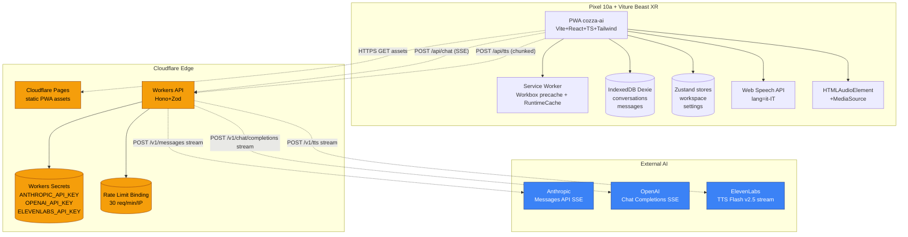

# cozza-ai — Architecture Final (Phase 1 Execution-Ready)

> **Documento autoritativo per la Phase 1 (MVP).**
> Versione: 1.0 — Data: 2026-05-01 — Stato: APPROVED FOR IMPLEMENTATION
> Autore: solution-architect (review di Phase 0)
>
> Questo documento **chiude** Phase 0 e dà a `senior-frontend-dev`, `senior-backend-dev`, `ai-engineer`, `devops-engineer`, `code-reviewer` e `security-auditor` tutto il contesto per eseguire Phase 1 senza ambiguità. Per il *perché* delle scelte vedi `02-solution-architecture.md`. Qui c'è il *cosa* e il *come*.

---

## 0. Conferme & deviazioni rispetto a Phase 0

**Phase 0 confermata** con 1 deviazione strategica grossa (deploy target).
Le 5 decisioni cardine restano immutate:
1. ~~Stack edge-only (CF Workers)~~ → **Aruba VPS** (vedi ADR-002 aggiornato): nginx + PM2 + Node Hono. Stessa filosofia "no PC casa nel critical path", solo cambia il provider edge.
2. Voice loop <2s tramite sentence chunker + ElevenLabs streaming
3. Glasses-first UI (sweet spot 70%, OLED #000, accent `#00E5FF`, font Geist 18px+)
4. Hard cap costo €30/mese (driver: ElevenLabs Creator €22) — VPS condivisa con altri progetti, costo marginale 0
5. Zero API key client-side

**Aggiornamenti minori:**

| Item | Phase 0 | Final | Motivazione |
|---|---|---|---|
| Rischio R1 (USB-C DP Alt Mode) | Open, da verificare prima di acquisto | **Closed** — Pixel 10a confermato compatibile | Hardware ordinato 2026-05-01, in arrivo 2026-05-04 |
| ElevenLabs delivery | WebSocket | **HTTP streaming POST** (`/v1/text-to-speech/{voice_id}/stream`) con `optimize_streaming_latency=4` | WS richiede bridge bidirezionale Worker complicato; HTTP streaming è equivalente in TTFB ed enormemente più semplice da proxare. WS resta opzione V2 se serve interruzione mid-frame |
| Tipi condivisi front/back | Implicito | **`packages/shared`** workspace con Zod schemas + tipi TS inferred | Single source of truth per request/response, no drift |
| Audio playback frontend | MediaSource API | **`HTMLAudioElement` + `URL.createObjectURL` su Blob streamed** in V0; MediaSource API tenuta per V1 se vediamo glitch | MediaSource ha edge case su Chrome Android con MP3 streaming; semplifichiamo nel MVP |
| Rate limiting | Durable Object dedicato | **Cloudflare native rate limiting** binding (`unsafe.bindings.cf-rate-limit` o `@cloudflare/rate-limit`) per MVP, DO solo se servirà sliding window personalizzata in V1 | Riduce ~150 LoC e zero state da gestire |

---

## 1. Tree definitivo del monorepo

```
cozza-ai/
├── .github/
│   └── workflows/
│       ├── ci.yml              # lint + typecheck + test + build su PR
│       └── deploy.yml          # deploy CF Pages + Workers su tag
├── .husky/
│   └── pre-commit              # lint-staged
├── apps/
│   ├── web/                    # PWA Vite + React
│   │   ├── public/
│   │   │   ├── icons/          # PWA icons 192/512
│   │   │   └── manifest.webmanifest
│   │   ├── src/
│   │   │   ├── components/
│   │   │   │   ├── chat/
│   │   │   │   │   ├── ChatBubble.tsx
│   │   │   │   │   ├── MessageList.tsx
│   │   │   │   │   ├── PromptInput.tsx
│   │   │   │   │   └── ModelSelector.tsx
│   │   │   │   ├── voice/
│   │   │   │   │   ├── VoiceButton.tsx
│   │   │   │   │   └── VoiceWaveform.tsx
│   │   │   │   └── layout/
│   │   │   │       ├── AppShell.tsx
│   │   │   │       └── Sidebar.tsx
│   │   │   ├── hooks/
│   │   │   │   ├── useChat.ts          # streaming SSE chat
│   │   │   │   ├── useVoiceInput.ts    # Web Speech API wrapper
│   │   │   │   ├── useTts.ts           # ElevenLabs proxy + playback + barge-in
│   │   │   │   ├── useConversations.ts # Dexie liveQuery
│   │   │   │   └── useMessages.ts
│   │   │   ├── stores/
│   │   │   │   ├── workspace.ts        # Zustand — V1 hook predisposto
│   │   │   │   └── settings.ts         # Zustand persist (model default, voice)
│   │   │   ├── lib/
│   │   │   │   ├── api.ts              # client fetch + SSE parser
│   │   │   │   ├── intent.ts           # executeIntent() stub V1
│   │   │   │   ├── db.ts               # Dexie schema + DB instance
│   │   │   │   └── audio.ts            # AudioPlayer class con barge-in
│   │   │   ├── workers/
│   │   │   │   └── wake-word.worker.ts # placeholder V1 Porcupine
│   │   │   ├── styles/
│   │   │   │   └── globals.css         # Tailwind base + Geist
│   │   │   ├── App.tsx
│   │   │   ├── main.tsx
│   │   │   └── vite-env.d.ts
│   │   ├── index.html
│   │   ├── package.json
│   │   ├── tailwind.config.ts
│   │   ├── postcss.config.cjs
│   │   ├── tsconfig.json
│   │   ├── vite.config.ts
│   │   └── .env.example
│   └── api/                    # CF Workers + Hono
│       ├── src/
│       │   ├── index.ts        # Hono app + routes
│       │   ├── routes/
│       │   │   ├── chat.ts     # /api/chat/anthropic + /api/chat/openai (SSE)
│       │   │   ├── tts.ts      # /api/tts (proxy ElevenLabs streaming)
│       │   │   └── health.ts   # /api/healthz
│       │   ├── middleware/
│       │   │   ├── cors.ts
│       │   │   ├── csp.ts
│       │   │   ├── rate-limit.ts
│       │   │   └── validate.ts # Zod helper
│       │   ├── lib/
│       │   │   ├── anthropic.ts
│       │   │   ├── openai.ts
│       │   │   ├── elevenlabs.ts
│       │   │   └── sentence-chunker.ts # split su [.!?] per voice pipeline V1+
│       │   └── types/
│       │       └── env.ts      # Bindings interface
│       ├── package.json
│       ├── tsconfig.json
│       ├── wrangler.toml
│       └── .dev.vars.example   # template secrets locali
├── packages/
│   └── shared/                 # tipi & Zod schema condivisi
│       ├── src/
│       │   ├── chat.ts         # ChatRequest, ChatStreamEvent, Message
│       │   ├── tts.ts          # TtsRequest
│       │   ├── intent.ts       # Intent enum + IntentParams
│       │   └── index.ts
│       ├── package.json
│       └── tsconfig.json
├── .gitignore
├── .editorconfig
├── .nvmrc                      # 20.18.0
├── .prettierrc
├── .eslintrc.cjs
├── package.json                # root, scripts orchestratori
├── pnpm-workspace.yaml
├── pnpm-lock.yaml
├── tsconfig.base.json          # path mapping per @cozza/shared
├── README.md
├── CHANGELOG.md
├── 00-EXECUTIVE-BRIEF.md
├── SETUP-GUIDE.md
├── docs/                       # già esistente
├── prompts/                    # già esistente
└── assets/
```

**Decisioni di struttura motivate:**

- `packages/shared` separato da `apps/api` per evitare import circolari Workers→Web e per testare i Zod schemi indipendentemente
- `apps/web/src/workers/wake-word.worker.ts` esiste vuoto come **hook V1** — il file viene importato pigramente dal SW solo se `IS_V1=true`, così oggi pesa 0 byte nel bundle ma quando arriviamo a V1 abbiamo già il path pronto
- Niente `apps/landing` separato per l'MVP: il dominio è personale, no marketing site

---

## 2. ADR consolidati

### ADR-001 — Stack hosting: VPS Aruba (deviazione da Phase 0)
**Decision:** `cozza-ai.vibecanyon.com` su VPS Aruba 188.213.170.214 (già attiva con altri progetti Cozza). nginx subdomain con SSL Let's Encrypt + Node Hono via PM2 (`cozza-ai-api` su 127.0.0.1:3025).

**Why:** Cozza ha già VPS Aruba con 15+ progetti deployati con questo identico pattern. Costo marginale 0 (la VPS è pagata). Latenza Milano→Aruba <30ms. Pattern conosciuto: nginx subpath/subdomain + PM2 + certbot. Stesso effetto edge ma senza il cost-of-switch a Cloudflare.

**Trade-off accettati:**
- (-) Single point of failure (la VPS) vs CF edge globale → accettabile per use-case mono-utente
- (-) Manutenzione SO/aggiornamenti a carico Cozza → già fatta per gli altri progetti
- (+) Stesso flow deploy degli altri progetti (deploy.sh + rsync + PM2)
- (+) Logs centralizzati su `/var/log/pm2/`
- (+) Niente vendor lock-in CF

**Alternative scartate:** Cloudflare Workers (stack edge-only originale) — ottima ma cost-of-switch ingiustificato. Tenuta come opzione V2 se la VPS dovesse diventare un collo di bottiglia.

### ADR-002 — Voice loop pipeline (confermato + dettaglio)
Web Speech API (input, IT) → POST `/api/chat` SSE → Worker chunka risposta su `[.!?]` → primo segment chiama `/api/tts` → `HTMLAudioElement` riproduce stream MP3 → barge-in via `audio.pause()` + `AbortController.abort()`.

**Trick TTFB:** primo `delta` SSE che contiene `[.!?]` triggera fetch TTS in **parallelo** con la continuazione del chat stream. Targeting <2s end-to-end:
- 200ms STT finalresult
- 100ms request → Worker → Anthropic
- 400ms TTFT prima frase Claude
- 300ms ElevenLabs Flash TTFB
- 100ms playback start
- = **~1.1s percepiti** (resta margine).

### ADR-003 — Storage Dexie (confermato)
Vedi §4 sotto per schema esatto.

### ADR-004 — Rate limiting in-memory token bucket (Node)
Nodejs single-process (PM2 fork instances=1) → mappa in-memory `Map<key, { count, resetAt }>` con finestra 60s. 30 req/min per `ip:path`. Reset automatico, GC opportunistico se size >1000.

**Why:** consistenza fra deploy precedente CF Workers (rate-limit binding) e nuovo Node target. In-memory è OK su instances=1; per scale-out V1+ → swap a Redis ([ioredis](https://github.com/redis/ioredis)) senza cambiare l'interfaccia.

`ALLOWED_ORIGINS` e `RATE_LIMIT_PER_MIN` sono in `apps/api/.env`.

### ADR-005 — Hooks V1 nel MVP (NUOVO, critico)
Per non refactorare quando arriva V1 (wake word + intent classifier + workspaces), MVP **predispone già**:

1. **Zustand `useWorkspaceStore`** già istanziato in `App.tsx`, default `'casual'`. UI MVP non lo legge mai.
2. **`executeIntent(intent, params)`** stub in `lib/intent.ts` con tutti gli intent enumerati ma solo `START_CHAT` implementato; gli altri ritornano `{ ok: false, reason: 'not_implemented' }`.
3. **Service worker** registrato con `vite-plugin-pwa` con un commento `// V1: register porcupine here` nel registerType custom. File `wake-word.worker.ts` esiste vuoto.

Costo: ~30 LoC, 0 byte runtime. Beneficio: V1 si attacca senza spostare nulla.

### ADR-006 — Tipi condivisi via `packages/shared` (NUOVO)
TS path alias `@cozza/shared` mappato in `tsconfig.base.json`. Front-end e Workers importano gli **stessi Zod schema**. Niente OpenAPI, niente codegen — Zod è il contratto.

### ADR-007 — Streaming chat: SSE re-emit puro (NUOVO)
Il Worker fa **passthrough** dei chunk SSE Anthropic/OpenAI dopo aver normalizzato il formato in un evento unificato. Niente buffering server-side per non aggiungere latenza.

### ADR-008 — Audio playback: HTMLAudioElement con Blob URL streamed (deviazione)
Phase 0 menzionava MediaSource. Su Chrome Android MediaSource API ha edge case con MP3 streaming chunked. Approccio MVP:

```ts
// Pseudo
const ms = new MediaSource();
audio.src = URL.createObjectURL(ms);
ms.addEventListener('sourceopen', () => {
  const sb = ms.addSourceBuffer('audio/mpeg');
  reader.read().then(function pump({ value, done }) {
    if (done) return ms.endOfStream();
    sb.appendBuffer(value);
    return reader.read().then(pump);
  });
});
```

Se questa pipeline dà glitch in test reale Pixel 10a, fallback a `audio/mpeg` Blob completo (latency +200-500ms) con feature flag `useStreamingAudio`. MediaSource resta default; flag come safety net.

---

## 3. C4 Container Diagram



---

## 4. Contratti API (Zod schemas, autoritativi)

Gli schemi vivono in `packages/shared/src/`. Workers e PWA li importano entrambi.

### 4.1 `chat.ts`

```ts
import { z } from 'zod';

export const ChatProviderSchema = z.enum(['anthropic', 'openai']);
export type ChatProvider = z.infer<typeof ChatProviderSchema>;

export const ChatModelSchema = z.enum([
  'claude-haiku-4-5',
  'claude-sonnet-4-6',
  'gpt-4o-mini',
  'gpt-4o',
]);
export type ChatModel = z.infer<typeof ChatModelSchema>;

export const ChatMessageSchema = z.object({
  role: z.enum(['user', 'assistant', 'system']),
  content: z.string().min(1).max(50_000),
});
export type ChatMessage = z.infer<typeof ChatMessageSchema>;

export const ChatRequestSchema = z.object({
  provider: ChatProviderSchema,
  model: ChatModelSchema,
  messages: z.array(ChatMessageSchema).min(1).max(100),
  temperature: z.number().min(0).max(2).optional(),
  maxTokens: z.number().int().positive().max(8192).optional(),
});
export type ChatRequest = z.infer<typeof ChatRequestSchema>;

// SSE event payloads (server → client)
export type ChatStreamEvent =
  | { type: 'delta'; text: string }
  | { type: 'done'; usage?: { inputTokens: number; outputTokens: number } }
  | { type: 'error'; code: string; message: string };
```

**SSE format esatto:**
```
event: delta
data: {"type":"delta","text":"Ciao"}

event: delta
data: {"type":"delta","text":", come"}

event: done
data: {"type":"done","usage":{"inputTokens":42,"outputTokens":120}}
```

### 4.2 `tts.ts`

```ts
import { z } from 'zod';

export const TtsRequestSchema = z.object({
  text: z.string().min(1).max(5000),
  voiceId: z.string().min(1).max(64),
  // optional override; default in Worker = "eleven_flash_v2_5"
  modelId: z.enum(['eleven_flash_v2_5', 'eleven_multilingual_v2']).optional(),
});
export type TtsRequest = z.infer<typeof TtsRequestSchema>;
```

**Response:** `Content-Type: audio/mpeg`, body è la stream MP3 di ElevenLabs ri-emessa così com'è.

### 4.3 `intent.ts` (V1 hook)

```ts
import { z } from 'zod';

export const IntentSchema = z.enum([
  'START_CHAT',         // implementato MVP
  'SWITCH_WORKSPACE',   // V1
  'OPEN_APP',           // V1
  'STOP',               // V1
  'READ_LAST',          // V1
  'OPEN_TERMINAL',      // V1
]);
export type Intent = z.infer<typeof IntentSchema>;

export type IntentResult =
  | { ok: true }
  | { ok: false; reason: 'not_implemented' | 'invalid_params' | 'failed'; detail?: string };
```

### 4.4 `/api/healthz`
- `GET` → `200 { status: "ok", commit: "<sha>", timestamp: "<iso>" }`

### 4.5 Headers obbligatori (response)
```
Content-Security-Policy: default-src 'self'; connect-src 'self' https://*.cloudflare.com; media-src 'self' blob:; img-src 'self' data:;
Strict-Transport-Security: max-age=31536000; includeSubDomains
X-Content-Type-Options: nosniff
Referrer-Policy: strict-origin-when-cross-origin
Permissions-Policy: microphone=(self), camera=(), geolocation=()
```

### 4.6 CORS allowlist
```ts
const ALLOWED_ORIGINS = [
  'https://cozza-ai.pages.dev',
  'http://localhost:5173', // dev
];
```
**Mai** `*` quando ci sono Authorization/Cookie. Per MVP non c'è auth user-level (single-tenant) ma la allowlist resta per defense-in-depth.

---

## 5. Schema IndexedDB (Dexie)

```ts
// apps/web/src/lib/db.ts
import Dexie, { Table } from 'dexie';

export interface Conversation {
  id: string;            // uuid v7
  title: string;         // primi 60 char primo user msg
  provider: 'anthropic' | 'openai';
  model: string;
  createdAt: number;     // unix ms
  lastMessageAt: number;
  messageCount: number;
}

export interface MessageRecord {
  id: string;            // uuid v7
  conversationId: string;
  role: 'user' | 'assistant' | 'system';
  content: string;
  createdAt: number;
  audioBlobKey?: string; // chiave verso store audioBlobs (opzionale)
  inputTokens?: number;
  outputTokens?: number;
}

export interface AudioBlob {
  key: string;           // uuid
  blob: Blob;
  createdAt: number;
}

export class CozzaDb extends Dexie {
  conversations!: Table<Conversation, string>;
  messages!: Table<MessageRecord, string>;
  audioBlobs!: Table<AudioBlob, string>;

  constructor() {
    super('cozza-ai');
    this.version(1).stores({
      conversations: 'id, lastMessageAt, provider',
      messages: 'id, conversationId, createdAt, [conversationId+createdAt]',
      audioBlobs: 'key, createdAt',
    });
  }
}

export const db = new CozzaDb();
```

**Strategia migration:** `version(N).stores(...).upgrade(...)` per ogni schema bump. Audio TTS non viene cachato di default (LRU 50 MB sarà V1).

---

## 6. Hooks V1 nel MVP — dettaglio implementativo

### 6.1 `useWorkspaceStore` (Zustand)

```ts
// apps/web/src/stores/workspace.ts
import { create } from 'zustand';
import { persist } from 'zustand/middleware';

export type WorkspaceId = 'casual' | 'lavoriamo' | 'cinema' | 'studio' | 'ambient';

interface WorkspaceState {
  active: WorkspaceId;
  setActive: (id: WorkspaceId) => void;
}

export const useWorkspaceStore = create<WorkspaceState>()(
  persist(
    (set) => ({
      active: 'casual',
      setActive: (id) => set({ active: id }),
    }),
    { name: 'cozza-workspace' },
  ),
);
```

UI MVP **non legge mai `active`**. Lo store esiste e persiste in localStorage. V1 leggerà.

### 6.2 `executeIntent()` stub

```ts
// apps/web/src/lib/intent.ts
import type { Intent, IntentResult } from '@cozza/shared';

export interface IntentParams {
  text?: string;
  app?: string;
  workspace?: string;
}

export async function executeIntent(
  intent: Intent,
  params: IntentParams = {},
): Promise<IntentResult> {
  switch (intent) {
    case 'START_CHAT':
      // implementato: handler in App emette evento custom 'cozza:start-chat'
      window.dispatchEvent(new CustomEvent('cozza:start-chat', { detail: params }));
      return { ok: true };
    case 'SWITCH_WORKSPACE':
    case 'OPEN_APP':
    case 'STOP':
    case 'READ_LAST':
    case 'OPEN_TERMINAL':
      return { ok: false, reason: 'not_implemented' };
  }
}
```

### 6.3 Service Worker hook
`vite-plugin-pwa` registra il SW base. In `apps/web/src/workers/wake-word.worker.ts` placeholder vuoto:
```ts
// V1: Picovoice Porcupine WASM goes here.
// MVP: this file is intentionally empty and not loaded.
export {};
```

---

## 7. Tabella rischi aggiornata

| ID | Rischio | Phase 0 sev | Final sev | Mitigazione |
|---|---|---|---|---|
| R1 | USB-C DP Alt Mode su telefono | P0 | **CLOSED** | Pixel 10a confermato OK |
| R2 | Web Speech API IT in ambienti rumorosi | P1 | P1 | Fallback Whisper API toggleabile (post-MVP) |
| R3 | Costi ElevenLabs runaway | P1 | P1 | Hard cap settabile + fallback Web Speech TTS browser |
| R4 | MediaSource glitch su Chrome Android | P2 | **P1** | Feature flag `useStreamingAudio`, fallback Blob completo |
| R5 | `vite-plugin-pwa` SW conflict con Porcupine V1 | P2 | P2 | Tenere SW minimale, registrare wake-word worker via `Worker()` separato non SW |
| R6 | Tailscale latency sul "Lavoriamo" V1 | P2 | P2 | V1 — non blocca MVP |
| R7 | Wrangler Windows-native vs WSL2 | — | **NUOVO P2** | Documentare in SETUP-GUIDE; raccomandare WSL2 ma supportare entrambi |
| R8 | Pixel 10a non in mano fino al 2026-05-04 | — | **NUOVO P2** | Sviluppo fino a giovedì 2026-05-07 in browser desktop con devtools mobile emulation; voice loop testabile su Chrome desktop |

---

## 8. DOR / DOD per ogni step Phase 1

### Step 1.1 — architecture-final.md
- **DOR:** docs Phase 0 letti ✓
- **DOD:** documento committato, tutte le sezioni 1-9 presenti, diagramma Mermaid renderizzato, ADR-001..008 enumerati ✓

### Step 1.2 — Frontend scaffold + DevOps
- **DOR:** Step 1.1 done; Node 20+, pnpm 9 disponibili
- **DOD:**
  - `apps/web/` con Vite + React + TS strict + Tailwind + vite-plugin-pwa + Zustand + Dexie installato
  - `apps/web/index.html` con `<html lang="it">`, `color-scheme: dark`, viewport mobile
  - Tailwind config con palette `oled` (`#000000`, `#0A0A0A`, `#1A1A1A`, accent `#00E5FF`), font `Geist`
  - `manifest.webmanifest` con `display: standalone`, `theme_color: #000`, icons 192/512
  - `vite.config.ts` con `vite-plugin-pwa` configurato `registerType: 'autoUpdate'`
  - `.github/workflows/ci.yml` con jobs `lint`, `typecheck`, `test`, `build`
  - `.husky/pre-commit` con `lint-staged` (eslint + prettier)
  - `.env.example` documentato
  - `pnpm dev` apre la pagina vuota su `http://localhost:5173` con manifest valido

### Step 1.3 — Backend Workers + security
- **DOR:** Step 1.2 in corso o done; account Cloudflare attivo
- **DOD:**
  - `apps/api/` con Hono + Zod + wrangler
  - 4 endpoint funzionanti: `POST /api/chat/anthropic`, `POST /api/chat/openai`, `POST /api/tts`, `GET /api/healthz`
  - SSE passthrough Anthropic + OpenAI testato via curl (`curl -N`)
  - `/api/tts` ritorna `audio/mpeg` chunked
  - Middleware `cors`, `csp`, `validate(zodSchema)`, `rate-limit` attivi
  - `wrangler.toml` con bindings rate limit + secrets template
  - `pnpm --filter api dev` espone localhost:8787
  - Security checklist: nessuna API key nel bundle finale (`grep` su `dist/`), CORS strict, CSP attivo, body-size limit 1MB, no full prompt in logs (solo `messages.length` + `model`)

### Step 1.4 — UI chat + UX glasses-first
- **DOR:** Step 1.3 in corso (almeno `/api/chat/*` funzionante)
- **DOD:**
  - `ChatBubble`, `MessageList` (con virtualization se >50 msg), `PromptInput` (Textarea autoresize, Cmd+Enter send), `ModelSelector` (segmented control 4 opzioni)
  - Streaming character-by-character con buffer 50ms
  - Markdown rendering con `react-markdown` + `rehype-highlight`
  - Layout glasses-first: contenuto core nel 70% centrale, padding generoso, font 18px+
  - Dark mode forzato via `<html class="dark">` + Tailwind `darkMode: 'class'`
  - Test manuale: 3 messaggi a Claude + 3 a OpenAI, streaming visibile, no flicker

### Step 1.5 — code-reviewer pre-merge W1
- **DOR:** Steps 1.2, 1.3, 1.4 done
- **DOD:**
  - Tutti i file passano ESLint + Prettier + tsc
  - Coverage minimo (no test obbligatori in W1, ma typecheck deve passare)
  - PR review checklist passato (vedi §10)
  - Smoke test E2E: utente apre `localhost:5173`, manda 1 messaggio a Claude, riceve risposta streamed, manda 1 a OpenAI, idem

### Step 2.1-2.5 (W2)
DOR/DOD analoghi, con focus voice loop end-to-end <2.5s misurato e Dexie storage verificato cross-reload.

---

## 9. Choke points & fail-fast checks

Punti dove se sbagliamo perdiamo ore. Da verificare **per primi**.

1. **`pnpm` workspace + Vite + vite-plugin-pwa coabitano.** Test: `pnpm install` root, `pnpm --filter web dev` apre Vite, dev tools mostra `manifest.webmanifest` valido. Se rotto, **fail-fast** e fix prima di scrivere componenti.

2. **`wrangler dev` da Windows nativo o richiede WSL2?** Su Windows 11 wrangler 3.x funziona nativo. Test: `pnpm --filter api dev` su CMD/PowerShell. Se errori `node-gyp`, switchare a WSL2. Documentare in SETUP-GUIDE.

3. **SSE through Cloudflare Workers in dev locale.** Test minimale Day 1: endpoint `/api/healthz` ritorna stream `event: ping\ndata: ok\n\n` ogni 1s. Se non funziona, niente chat funziona. Bloccante.

4. **Tailwind v4 vs v3.** Tailwind v4 (alpha-ish) ha breaking changes. **Usare v3.4** stable per MVP. v4 in V2 quando esce 4.0 GA.

5. **Pnpm path alias `@cozza/shared` risolto da TS, Vite, e Wrangler/esbuild.** Tre config diversi (tsconfig.base, vite.config, wrangler.toml). Test: import in apps/web e apps/api dello stesso schema, build entrambi.

---

## 10. Code review checklist (Step 1.5)

```
[Security]
- [ ] Nessuna API key nel bundle prod (`grep -r "sk-" dist/` vuoto)
- [ ] CORS allowlist configurato (no `*`)
- [ ] CSP header attivo e testato in browser devtools
- [ ] Rate limit testato (>30 req/min ritorna 429)
- [ ] Body-size limit attivo (`Content-Length` >1MB ritorna 413)
- [ ] No PII in logs (solo metadata: provider, model, msgCount)

[Code quality]
- [ ] TypeScript strict, no `any` senza TODO commento
- [ ] ESLint pass, no warnings ignorati
- [ ] No console.log in src/ (solo logger strutturato)
- [ ] Funzioni <50 righe, file <300 righe (con eccezioni motivate)
- [ ] Naming kebab-case file, camelCase var, PascalCase componenti

[PWA]
- [ ] Manifest valid (lighthouse PWA score >90)
- [ ] Icons 192/512 presenti
- [ ] SW registrato e cache app shell
- [ ] HTTPS in dev (vite https) e prod

[Streaming]
- [ ] SSE chat passthrough funziona (curl -N)
- [ ] Stream non bufferato server-side (no 5s wait poi tutto insieme)
- [ ] Errori SSE propagati con `event: error`

[Hooks V1]
- [ ] useWorkspaceStore istanziato (vedi Redux DevTools / Zustand devtools)
- [ ] executeIntent('START_CHAT') ritorna { ok: true }
- [ ] executeIntent('SWITCH_WORKSPACE') ritorna { ok: false, reason: 'not_implemented' }
- [ ] File wake-word.worker.ts esiste vuoto

[Git]
- [ ] Commit conventional (feat(web), feat(api), chore, etc.)
- [ ] Branch `feature/W1-scaffold` o simile
- [ ] No commit `--no-verify`
- [ ] CHANGELOG aggiornato
```

---

## 11. Domande aperte (non bloccanti)

1. **Voice ID ElevenLabs italiana.** Cozza deve scegliere e settare `VITE_ELEVENLABS_VOICE_ID`. Suggerimenti: `Bianca` o `Giorgio` (cataloghi ElevenLabs IT). Default in `.env.example` come placeholder `<scegli su elevenlabs.io>`.
2. **Dominio custom.** Per ora `cozza-ai.pages.dev`. Passaggio a `cozza.cloud/ai` o sottodominio? Decisione V1, niente costo.
3. **Sentry / error tracking.** MVP esce senza. V1 si valuta (free tier 5k events/mese ok).

---

## 12. Riassunto operativo

- **Phase 0 confermata** + 7 deviazioni minori documentate (ADR-006/007/008 nuovi, R4/R7/R8 nuovi)
- **Tree definitivo monorepo** pnpm con `apps/web`, `apps/api`, `packages/shared`
- **API contracts in Zod** condivisi
- **Schema Dexie** v1 (3 tabelle)
- **Hooks V1** nel MVP per evitare refactor
- **DOR/DOD** granulare per ogni step
- **Choke points** da verificare entro Day 1
- **Bloccanti per Step 1.2:** nessuno. Si parte.

**Forza Cozza, attacchiamo W1.**
